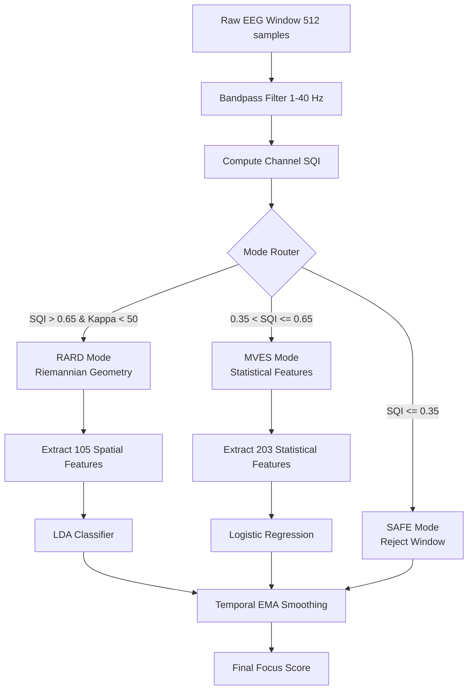

# Artificial Intelligence Models

The `hazeclue-ai` repository contains the sophisticated machine learning pipelines that power the core "Brain-Computer Interface" (BCI) capabilities of HazeClue. 

## The RARD–MVES v2.2 Engine
This engine is a **Hybrid Riemannian–Statistical EEG Inference System with Empirically Calibrated Mode Switching**. Because consumer EEG devices (like EMOTIV or dry-electrode headsets) suffer from frequent signal degradation, this AI does not rely on a single static model. Instead, it dynamically switches inference modes based on real-time Signal Quality Index (SQI).

## Inference Pipeline Implementation (`inference/engine.py`)

The `HazeClueInferenceEngine` manages the entire lifecycle of a prediction window (4 seconds, 50% overlap).

### 1. Calibration Phase
Before active inference, the system records 60 seconds of resting state EEG to compute the **Fréchet Mean** (geometric mean on the SPD manifold). This establishes a localized baseline `P_ref` for the specific user's brain topology.

### 2. Window Acceptance Policy
Windows are aggressively validated:
- `MIN_GLOBAL_SQI = 0.2`
- If the mean SQI falls below this, the window is rejected (SAFE mode) and returns the last smoothed prediction to avoid sudden UI jumps.

### 3. Covariance Stabilization
To prevent mathematical collapse when channels fail:
1. `P_weighted = Σ^½ P Σ^½` (Weighting by SQI)
2. `P_reg = (1-λ)P + λI` (Ledoit-Wolf shrinkage)
3. Eigenvalue grounding at `ε = 10⁻⁶` to force Symmetric Positive Definite (SPD) properties.

### 4. Feature Extraction & Classification
- **RARD (Riemannian Geometry):** Projects the covariance matrix onto the tangent space at the baseline reference `P_ref`. Generates 105 spatial connectivity features. High accuracy, low noise tolerance.
- **MVES:** Calculates Bandpowers (Delta, Theta, Alpha, Beta), Hjorth parameters (Activity, Mobility, Complexity), and Spectral tilts. Generates 203 features. Highly robust to noise.

### 5. Temporal Smoothing (EMA)
To prevent the focus score from jittering, the engine applies an Exponential Moving Average (EMA) with `γ = 0.7`:
`smoothed_prediction = (0.7 × raw_score) + (0.3 × previous_smoothed)`

## Edge-Cloud Deployment
The trained models (`sklearn` LDA/Logistic Regression) are exported via `onnx` and `skl2onnx` (`export_onnx.py`). This allows the Flutter mobile application to execute the inference locally using `onnxruntime_flutter` with a latency of `< 35ms`, completely offline.
