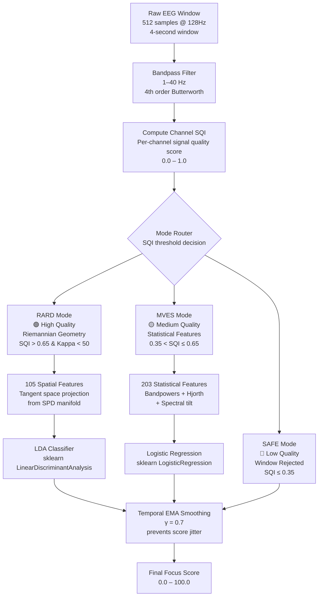

# AI Engine — RARD–MVES v2.2

> **Repository:** [`ameenmv/HazeClue_AI`](https://github.com/ameenmv/HazeClue_AI)

The HazeClue AI Engine is a **Hybrid Riemannian-Statistical EEG Inference System with Empirically Calibrated Mode Switching** (RARD–MVES v2.2). It is purpose-built for consumer-grade EEG devices (EMOTIV, Muse S, NeuroSky MindWave) that suffer from frequent electrode contact loss, motion artifacts, and signal degradation.

Instead of relying on a single static model that fails silently under noisy conditions, RARD–MVES **dynamically switches inference modes** based on real-time Signal Quality Index (SQI).

## System Overview



## Inference Modes

| Mode | Trigger Condition | Feature Count | Classifier | Use Case |
|------|------------------|---------------|-----------|----------|
| **RARD** | SQI > 0.65 AND Kappa < 50 | 105 spatial | LDA | Clean signal, high accuracy |
| **MVES** | 0.35 < SQI ≤ 0.65 | 203 statistical | Logistic Regression | Degraded signal, noise-robust |
| **SAFE** | SQI ≤ 0.35 | — | — | Window rejected; returns last prediction |

## Processing Pipeline

### Phase 1: Calibration (60 seconds)

Before active inference, the system records **60 seconds of resting-state EEG** to establish a personalized baseline:

1. Computes the **Fréchet Mean** (geometric mean on the SPD manifold) from all resting-state covariance matrices
2. This establishes `P_ref` — the individual's brain topology baseline
3. All subsequent inference uses this reference for Riemannian feature extraction

### Phase 2: Real-Time Inference (per window)

**Window parameters:** 4 seconds, 50% overlap (2-second step)

**Step 1: Signal Quality Assessment**

Each incoming 4-second window is scored on signal quality before processing:

```python
# From preprocessing/sqi.py
MIN_GLOBAL_SQI = 0.2

if mean_sqi < MIN_GLOBAL_SQI:
    # SAFE mode: return last smoothed prediction
    return self._last_smoothed_score
```

**Step 2: Covariance Stabilization**

To prevent mathematical collapse when channels degrade:

```python
# 1. SQI-weighted covariance
P_weighted = Σ^½ P Σ^½

# 2. Ledoit-Wolf shrinkage (regularization)
P_reg = (1 - λ) * P + λ * I

# 3. Eigenvalue grounding (force SPD)
eigenvalues = max(eigenvalues, ε=1e-6)
```

**Step 3: Feature Extraction**

**RARD — Riemannian Geometry (105 features):**
```python
# Project covariance onto tangent space at P_ref
S = logm(P_ref^(-½) @ P_reg @ P_ref^(-½))
features = upper_triangle(S)  # 105 connectivity features
```

**MVES — Statistical Features (203 features):**
```python
features = [
    *bandpowers(delta, theta, alpha, beta, gamma),  # 5 features
    *hjorth_params(activity, mobility, complexity),   # 3 per channel
    *spectral_tilt(slope, intercept),                # 2 per channel
    # ... totaling 203 features
]
```

**Step 4: Temporal Smoothing**

```python
# Exponential Moving Average (EMA) with γ = 0.7
smoothed = 0.7 * raw_score + 0.3 * previous_smoothed
```

This prevents the focus score from jittering on the UI.

## Model Training

| Component | Algorithm | Library |
|-----------|----------|---------|
| **RARD Classifier** | Linear Discriminant Analysis (LDA) | `sklearn` |
| **MVES Classifier** | Logistic Regression (L2, C=1.0) | `sklearn` |
| **Deep Learning Models** | EEGNet & ShallowConvNet | `pytorch` / `braindecode` |
| **Covariance Estimation** | Ledoit-Wolf Shrinkage | `sklearn.covariance` |
| **Riemannian Geometry** | Tangent Space Projection | `pyriemann` |
| **Spatial Filtering** | Filter Bank CSP (FBCSP) | `mne` / `scikit-learn` |

### Training Data

Training uses public EEG datasets with binary attention/non-attention labels:
- Subjects calibrate individually (60s resting baseline)
- Cross-validation with subject-independent hold-out sets
- Class imbalance handled via `class_weight='balanced'`

## ONNX Export for On-Device Inference

Trained models are exported as ONNX for execution in the Flutter mobile app:

```python
# From export/export_onnx.py
from skl2onnx import convert_sklearn
from skl2onnx.common.data_types import FloatTensorType

# Export RARD model (105 input features)
initial_type = [('input', FloatTensorType([None, 105]))]
onnx_model = convert_sklearn(rard_pipeline, initial_types=initial_type)
with open('trained_models/hazeclue_rard.onnx', 'wb') as f:
    f.write(onnx_model.SerializeToString())

# Export MVES model (203 input features)
initial_type = [('input', FloatTensorType([None, 203]))]
onnx_model = convert_sklearn(mves_pipeline, initial_types=initial_type)
with open('trained_models/hazeclue_mves.onnx', 'wb') as f:
    f.write(onnx_model.SerializeToString())
```

**On-Device Performance:**
| Metric | Value |
|--------|-------|
| Inference latency | **< 35ms** on modern devices |
| Model size (RARD) | ~2.1 MB |
| Model size (MVES) | ~4.7 MB |
| Offline capable | ✅ Yes — no network required |

## Repository Structure

```
hazeclue-ai/
├── preprocessing/          # EEG preprocessing (filtering, SQI, windowing)
├── features/               # Feature extractors (Riemannian, statistical)
├── training/               # Model training pipelines
├── inference/
│   └── engine.py           # HazeClueInferenceEngine (main runtime)
├── export/
│   └── export_onnx.py      # ONNX model export
├── islam/                  # Report generation and integration files
├── api/                    # Flask/FastAPI inference server
├── models/                 # Model definitions
├── trained_models/         # Saved .onnx + .pkl model files
├── notebooks/              # Research and analysis Jupyter notebooks
├── tests/                  # Unit + integration tests
├── requirements.txt
└── main.py
```

## Local Setup

```bash
# Clone the repository
git clone https://github.com/ameenmv/HazeClue_AI.git
cd HazeClue_AI

# Create virtual environment
python -m venv venv
source venv/bin/activate  # Linux/macOS
venv\Scripts\activate     # Windows

# Install dependencies
pip install -r requirements.txt

# Run the inference server
python main.py
```

**Key dependencies:**
```
numpy
scipy
scikit-learn
pyriemann
onnxruntime
skl2onnx
mne
```
