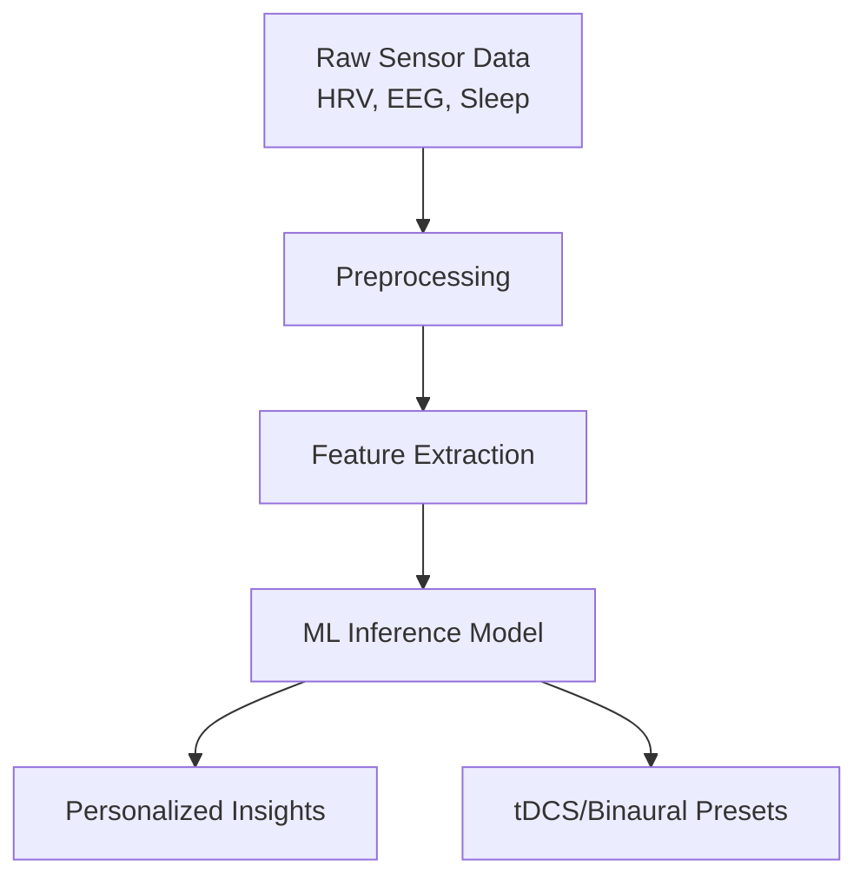

# Artificial Intelligence Models

The `hazeclue-ai` repository contains the machine learning pipelines and predictive models that power the personalization engine of HazeClue.

## Data Processing Pipeline

## Core Responsibilities
1. **Stress Detection:** Analyzes HRV (Heart Rate Variability) and sleep data to detect periods of high stress.
2. **Cognitive Load Analysis:** Interprets EEG frequency bands (Alpha, Beta, Theta) during training sessions to assess mental fatigue and focus levels.
3. **Adaptive Recommendations:** Automatically adjusts tDCS intensity suggestions and Binaural Beats frequencies based on the user's current cognitive state to maximize neuroplasticity safely.
