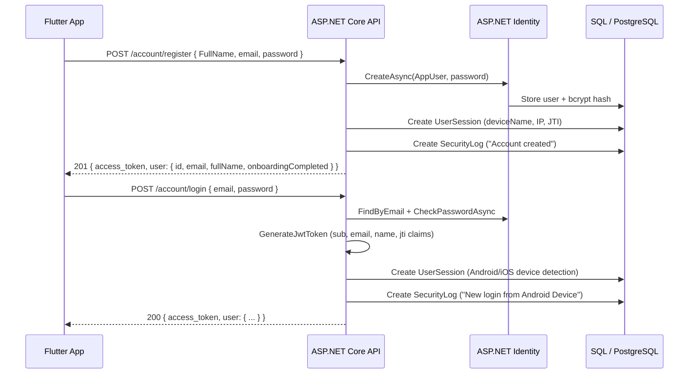

# Authentication & Security — Mobile Backend

> **Base path:** `/api/v1/account/...`

The Mobile Backend uses **ASP.NET Identity** with JWT Bearer tokens. Unlike typical stateless JWT, HazeClue tracks active sessions in the database and allows users to view and revoke devices — giving users full control over their security.

## Auth Flow



## Endpoints

### `POST /api/v1/account/register`

Creates a new user account and returns a JWT immediately (no email verification required).

**Request body:**
```json
{
  "FullName": "Ahmed Hassan",
  "email": "ahmed@example.com",
  "password": "SecurePass123!"
}
```

**Response `201 Created`:**
```json
{
  "access_token": "eyJhbGciOiJIUzI1NiIsInR5cCI6IkpXVCJ9...",
  "user": {
    "id": "3fa85f64-5717-4562-b3fc-2c963f66afa6",
    "email": "ahmed@example.com",
    "fullName": "Ahmed Hassan",
    "onboardingCompleted": false
  }
}
```

::: info `onboardingCompleted`
New users have `onboardingCompleted: false`. The Flutter app checks this field on login to redirect first-time users through the health assessment and tDCS consent onboarding flow before reaching the main dashboard.
:::

---

### `POST /api/v1/account/login`

Authenticates the user and creates a tracked session record with device detection.

**Device detection logic:**
```csharp
var userAgent = Request.Headers["User-Agent"].ToString();
if (userAgent.Contains("Android")) deviceName = "Android Device";
else if (userAgent.Contains("iPhone") || userAgent.Contains("iPad")) deviceName = "iOS Device";
else if (userAgent.Contains("Windows")) deviceName = "Windows PC";
else if (userAgent.Contains("Mac OS")) deviceName = "Mac";
else deviceName = "Web Browser";
```

**Response `200 OK`:**
```json
{
  "access_token": "eyJhbGciOiJIUzI1NiIsInR5cCI6IkpXVCJ9...",
  "user": {
    "id": "3fa85f64-5717-4562-b3fc-2c963f66afa6",
    "email": "ahmed@example.com",
    "fullName": "Ahmed Hassan",
    "onboardingCompleted": true
  }
}
```

---

### `POST /api/v1/account/forgot-password`

Generates a 6-digit OTP with a **15-minute** expiry.

```json
{ "email": "ahmed@example.com" }
```

::: tip Demo Behavior
OTP is printed to the server console (`Console.WriteLine`) for demo purposes. For testing convenience, a static OTP (e.g., `123456`) may also be enabled in development. Additionally, the OTP is intentionally not cleared immediately after verification to facilitate seamless multi-step testing during the demo phase. In production, this should integrate with an email provider and strictly clear the OTP post-verification.
:::

---

### `POST /api/v1/account/verify-otp`

Verifies the OTP and issues a `resetToken` (valid for 30 minutes).

**Request:**
```json
{
  "email": "ahmed@example.com",
  "otp": "482930"
}
```

**Response `200 OK`:**
```json
{
  "message": "OTP verified.",
  "resetToken": "a8b3c4d5-e6f7-4a8b-9c0d-e1f2a3b4c5d6"
}
```

---

### `POST /api/v1/account/reset-password`

Resets the password. Re-validates OTP at this step (the mobile flow combines OTP + new password in a single step).

**Request:**
```json
{
  "email": "ahmed@example.com",
  "otp": "482930",
  "newPassword": "NewPass456!"
}
```

---

### `POST /api/v1/account/change-password` 🔒

Changes password for the authenticated user. Records a `SecurityLog` entry on success.

```json
{
  "currentPassword": "OldPass123!",
  "newPassword": "NewPass456!"
}
```

---

### `POST /api/v1/account/logout` 🔒

Stateless JWT logout — the mobile app deletes the local token. Server responds `200 OK`.

---

## Session Management

HazeClue tracks all active login sessions in the `UserSessions` table, enabling users to see (and revoke) all their logged-in devices.

### `GET /api/v1/account/sessions` 🔒

Returns all active (non-revoked) sessions for the user, marking the current one with `isCurrent: true`.

**Response:**
```json
[
  {
    "id": "...",
    "deviceName": "Android Device",
    "location": "Unknown Location",
    "ipAddress": "192.168.1.100",
    "loginTime": "2026-05-29T10:00:00Z",
    "lastActive": "2026-05-29T17:00:00Z",
    "isCurrent": true
  },
  {
    "id": "...",
    "deviceName": "iOS Device",
    "loginTime": "2026-05-28T08:30:00Z",
    "lastActive": "2026-05-29T09:00:00Z",
    "isCurrent": false
  }
]
```

### `DELETE /api/v1/account/sessions/{id}` 🔒

Revoke a specific session by ID (marks `IsRevoked = true`).

### `DELETE /api/v1/account/sessions/other` 🔒

Revoke all sessions **except** the current one (based on JWT `jti` claim).

---

## Security Logs

### `GET /api/v1/account/security-logs` 🔒

Returns the 10 most recent security events for the user.

**Response:**
```json
[
  {
    "id": "...",
    "event": "New login from Android Device",
    "createdAt": "2026-05-29T17:00:00Z",
    "ipAddress": "192.168.1.100"
  },
  {
    "id": "...",
    "event": "Password changed successfully",
    "createdAt": "2026-05-28T14:30:00Z",
    "ipAddress": "192.168.1.50"
  }
]
```

## JWT Token Structure

```csharp
var claims = new List<Claim>
{
    new Claim(JwtRegisteredClaimNames.Sub, user.Id),       // User ID
    new Claim(JwtRegisteredClaimNames.Email, user.Email),  // Email
    new Claim(JwtRegisteredClaimNames.Name, user.FullName),// Full Name
    new Claim(JwtRegisteredClaimNames.Jti, jti)            // Unique session ID
};
```

| Claim | Description |
|-------|-------------|
| `sub` | User GUID — used by `ClaimTypes.NameIdentifier` in controllers |
| `email` | User email |
| `name` | Full name |
| `jti` | Unique token ID — used for session revocation tracking |

Token expiry defaults to **7 days**, configurable via `Jwt:ExpireDays` in `appsettings.json`.

## Using the Token in Flutter

```dart
// api_service.dart
static Future<Map<String, String>> _authHeaders() async {
  final token = await getToken();  // from SharedPreferences
  return {
    'Content-Type': 'application/json',
    if (token != null) 'Authorization': 'Bearer $token',
  };
}
```

All protected API calls use `_authHeaders()` to automatically inject the Bearer token.
