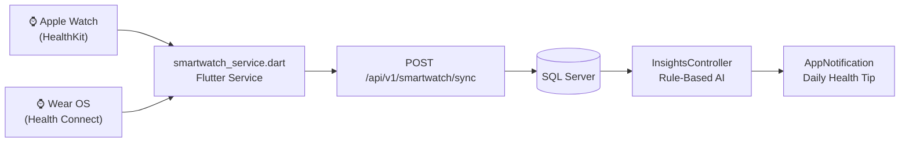

# Devices & Smartwatch — Mobile Backend

> 🔒 All endpoints require `Authorization: Bearer <token>`

## Devices API

The Devices module manages BCI/EEG/tDCS hardware registered by the user. Devices are identified by their **MAC address**, preventing duplicate registration.

**Base path:** `/api/v1/devices`

### Device Entity

| Field | Type | Description |
|-------|------|-------------|
| `Id` | `string (GUID)` | Auto-generated |
| `UserId` | `string` | FK → AppUser |
| `Name` | `string` | Display name (e.g., "Halo Sport", "Muse S Gen 2") |
| `MacAddress` | `string` | Hardware MAC — unique constraint per user |
| `Status` | `string` | `online` · `offline` |
| `CreatedAt` | `DateTime` | Auto-generated |

### `GET /api/v1/devices` 🔒

Returns all devices registered by the authenticated user.

**Response:**
```json
[
  {
    "id": "device-guid",
    "name": "Halo Sport (tDCS)",
    "macAddress": "AA:BB:CC:DD:EE:FF",
    "status": "offline",
    "createdAt": "2026-05-01T10:00:00Z"
  }
]
```

**From Flutter:**
```dart
final devices = await ApiService.getDevices();
final hasTdcs = devices.any((d) =>
  d['name'].toString().toLowerCase().contains('tdcs') ||
  d['name'].toString().toLowerCase().contains('halo')
);
```

---

### `POST /api/v1/devices` 🔒

Register a new device. Returns `400 Bad Request` if the MAC address is already registered.

**Request body:**
```json
{
  "name": "Muse S (Gen 2)",
  "macAddress": "AA:BB:CC:DD:EE:FF"
}
```

**From Flutter:**
```dart
await ApiService.addDevice(deviceName, macAddress);
```

::: warning Duplicate Prevention
The backend checks `(userId, macAddress)` uniqueness before creating. This prevents accidentally registering the same physical device twice.
:::

---

### `DELETE /api/v1/devices/{id}` 🔒

Permanently removes the device registration. Does not affect existing sessions that referenced this device.

**From Flutter:**
```dart
await ApiService.deleteDevice(deviceId);
```

---

## Smartwatch API

The Smartwatch module ingests health metrics from wearables connected via the mobile app (Apple Watch via HealthKit, Wear OS via Google Fit / Health Connect).

**Base path:** `/api/v1/smartwatch`

### SmartwatchData Entity

| Field | Type | Description |
|-------|------|-------------|
| `Id` | `string (GUID)` | Auto-generated |
| `UserId` | `string` | FK → AppUser |
| `HeartRate` | `double?` | Heart rate in BPM |
| `Hrv` | `double?` | Heart Rate Variability (ms) — key stress indicator |
| `SleepScore` | `double?` | Sleep score / hours |
| `Steps` | `int?` | Step count |
| `Timestamp` | `DateTime` | When the data was recorded on device |
| `CreatedAt` | `DateTime` | Server receipt time |

### `POST /api/v1/smartwatch/sync` 🔒

Ingest a new health data record from the smartwatch.

**Request body:**
```json
{
  "heartRate": 72.5,
  "hrv": 45.2,
  "sleepScore": 7.3,
  "steps": 6500,
  "timestamp": "2026-05-29T07:00:00Z"
}
```

**Response:**
```json
{ "message": "Smartwatch data synced successfully." }
```

::: tip HRV Importance
`Hrv` (Heart Rate Variability) is used by the AI Insights engine to detect physiological stress. Low HRV (< 40ms) combined with a high self-reported stress level triggers an `Alert` insight recommending a tDCS or focus session.
:::

---

### `GET /api/v1/smartwatch/summary` 🔒

Returns the 7 most recent smartwatch data records for the user.

**Response:**
```json
[
  {
    "id": "...",
    "heartRate": 72.5,
    "hrv": 45.2,
    "sleepScore": 7.3,
    "steps": 6500,
    "timestamp": "2026-05-29T07:00:00Z"
  }
]
```

## Data Flow


