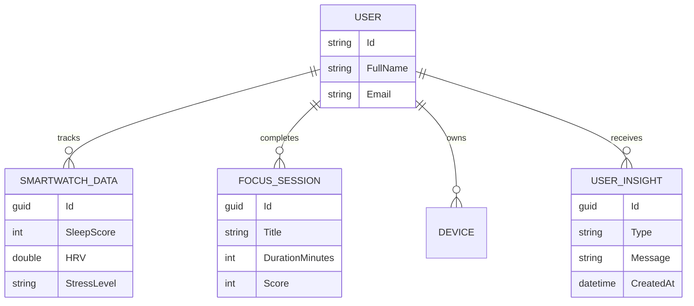

# Mobile Backend API (.NET Core)

The `HazeClue_backend_mobile` repository contains the robust API that serves the Flutter mobile application. It is responsible for data persistence, security, and complex business logic.

## Architecture & Stack
- **Framework:** ASP.NET Core Web API (C#)
- **Database:** Entity Framework Core (SQL Server / PostgreSQL)
- **Authentication:** JWT (JSON Web Tokens)
- **Architecture Pattern:** N-Tier / Clean Architecture principles (Core, Infrastructure, UI/API layers).

## Core Entities

## Key Services
1. **InsightGeneratorService:** A rule-based engine that processes recent `SmartwatchData` and user assessments to generate actionable `UserInsight` records (e.g., detecting high stress via HRV).
2. **AuthService:** Handles password hashing, JWT generation, and user registration pipelines.
3. **SmartwatchController:** Ingests health metrics from the mobile device.
