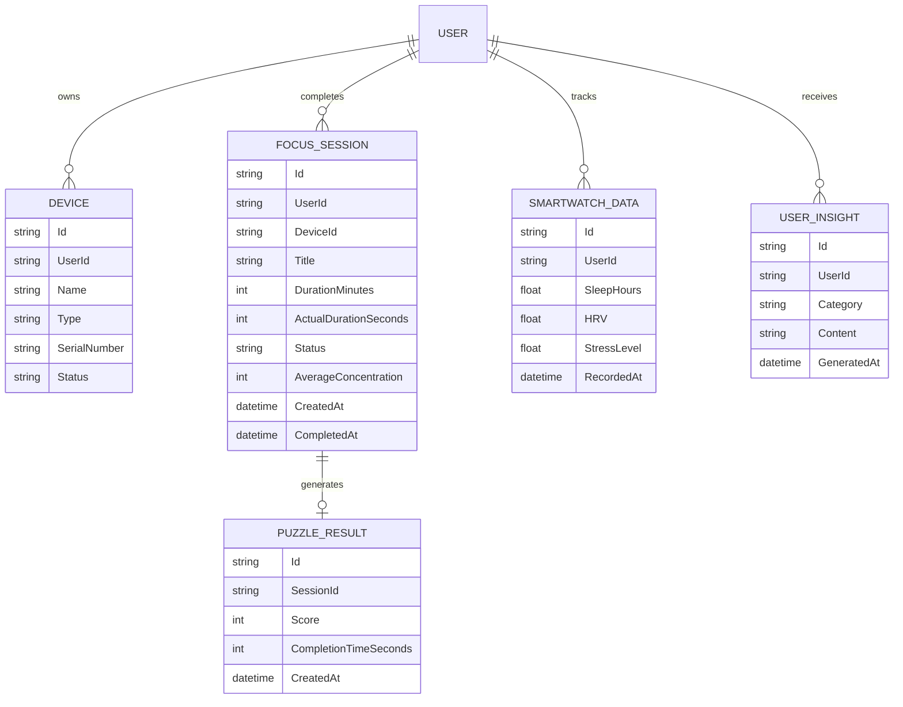

# Mobile Backend — ASP.NET Core

> **Repository:** [`HazeClue/Haze_clue_backend_mobile`](https://github.com/HazeClue/Haze_clue_backend_mobile)  
> **Postman Collection:** [HazeClue_Mobile_Postman_Collection.json](https://github.com/ameenmv/Haze_clue_backend_mobile/blob/main/HazeClue_Mobile_Postman_Collection.json)  
> **Base URL:** `http://localhost:5220/api/v1` (dev) · Production configured via `--dart-define`

## Module Overview

| Module | Base Path | Auth | Description |
|--------|-----------|------|-------------|
| Account | `/account` | 🌐 Public + 🔒 | Register, login, OTP, password reset, sessions |
| Users | `/users` | 🔒 | Profile, settings, notification preferences |
| Sessions | `/sessions` | 🔒 | Focus sessions, insights aggregation |
| Devices | `/devices` | 🔒 | BCI/EEG device management |
| Smartwatch | `/smartwatch` | 🔒 | Wearable health data sync |
| Insights | `/insights` | 🔒 | AI-generated daily health tips |
| Assessments | `/assessments` | 🔒 | Health survey + tDCS consent |
| Notifications | `/notifications` | 🔒 | In-app notification inbox |
| Dashboard | `/dashboard` | 🔒 | Aggregated home screen stats |
| Support | `/support` | 🔒 | Contact / ticket submission |

The Mobile Backend is the primary data persistence and business logic layer for the **Flutter mobile application**. Built on **ASP.NET Core Clean Architecture**, it handles cognitive session recording, hardware data ingestion, and AI-driven user insights.

## Architecture & Stack

| Layer | Technology |
|-------|-----------|
| **Framework** | ASP.NET Core Web API (C#) |
| **ORM** | Entity Framework Core |
| **Database** | SQL Server / PostgreSQL |
| **Authentication** | JWT Bearer Tokens (`System.IdentityModel.Tokens.Jwt`) |
| **Architecture** | Clean Architecture (Core → Infrastructure → UI layers) |
| **Validation** | FluentValidation |
| **Caching** | IMemoryCache |
| **Resilience** | Global Exception Handling, Rate Limiting |
| **Testing** | xUnit (Controller Tests, Service Tests, Integration Tests) |
| **Containerization** | Docker |

## Solution Structure

```
HazeClue.sln
├── HazeClue.Core/              # Domain entities, interfaces, value objects
│   └── Domain/
│       ├── FocusSession.cs
│       ├── Device.cs
│       ├── PuzzleResult.cs
│       ├── SmartwatchData.cs
│       └── UserInsight.cs
│
├── HazeClue.Infrastructure/    # EF Core DbContext, repositories, migrations
│
├── HazeClue.UI/               # ASP.NET Core Web API (Controllers, DTOs)
│   └── Controllers/v1/
│       ├── SessionsController.cs
│       ├── SmartwatchController.cs
│       ├── InsightsController.cs
│       └── AssessmentsController.cs
│
├── HazeClue.ControllerTests/   # Controller unit tests
├── HazeClue.ServiceTests/      # Service layer unit tests
└── HazeClue.IntegrationTests/  # End-to-end API tests
```

## Domain Model



## Core API Controllers

All endpoints are under `/api/v1` and secured with JWT `[Authorize]` attributes. User identity is extracted via ASP.NET Identity claims:

```csharp
var userId = User.FindFirstValue(ClaimTypes.NameIdentifier);
```

This ensures **zero cross-tenant data leakage** — every query is scoped to the authenticated user's ID.

### SessionsController

| Method | Endpoint | Description |
|--------|----------|-------------|
| `GET` | `/api/v1/Sessions` | Get all sessions (ordered by `CreatedAt DESC`) |
| `POST` | `/api/v1/Sessions` | Create new focus session linked to a device |
| `POST` | `/api/v1/Sessions/{id}/complete` | Mark session completed; saves avg concentration + fires notification |
| `POST` | `/api/v1/Sessions/{id}/score` | Submit cognitive game puzzle score (`PuzzleResult`) |
| `GET` | `/api/v1/Sessions/insights` | Get full analytics aggregate (focus time, weekly/monthly data) |

#### Session Insights Response

The `/Sessions/insights` endpoint performs **massive aggregation logic**:

```json
{
  "totalFocusSeconds": 87400,
  "averageMinutesPerDay": 20.5,
  "improvementPercentage": 12.5,
  "weeklyData": [45, 62, 38, 71, 55, 80, 47],
  "monthlyData": [
    { "month": "Dec", "minutes": 420 },
    { "month": "Jan", "minutes": 580 },
    { "month": "Feb", "minutes": 640 },
    { "month": "Mar", "minutes": 720 },
    { "month": "Apr", "minutes": 695 },
    { "month": "May", "minutes": 812 }
  ]
}
```

- `weeklyData` — sums `ActualDurationSeconds` for each of the past 7 days individually
- `improvementPercentage` — compares current 7 days vs previous 7 days (days 7–13)
- `monthlyData` — aggregates by month for the last 6 months

#### Session Completion Side Effects

When `POST /Sessions/{id}/complete` is called, the backend automatically:
1. Sets `Status = "completed"` and saves `ActualDurationSeconds` + `AverageConcentration`
2. **Creates an `AppNotification`** for the user: *"Session Completed! 🎉 Great job on completing your focus session!"*

### SmartwatchController

Ingests health metrics from wearables (Apple Watch, Google Wear OS):

```json
{
  "sleepHours": 7.5,
  "hrv": 42.3,
  "stressLevel": 28.1
}
```

### DashboardController

Serves aggregated statistics for the app's home screen. To optimize performance and reduce database load, responses are cached using `IMemoryCache` for quick retrieval during frequent app launches.

### InsightsController & AssessmentsController

- **Insights:** Generates AI-driven daily health tips based on the latest `SmartwatchData` and session patterns.
- **Assessments:** Retrieves personalized cognitive assessments and recommendations.

## Security Architecture

```csharp
// Every controller action extracts identity this way:
[Authorize]
[ApiController]
[Route("api/v1/[controller]")]
public class SessionsController : ControllerBase
{
    [HttpGet]
    public async Task<IActionResult> GetSessions()
    {
        var userId = User.FindFirstValue(ClaimTypes.NameIdentifier);
        var sessions = await _service.GetUserSessions(userId);
        return Ok(sessions);
    }
}
```

All data queries are **strictly scoped** to `userId` — no user can access another user's sessions, devices, or health data.

## Local Setup

```bash
# Clone the repository
git clone https://github.com/HazeClue/Haze_clue_backend_mobile.git
cd Haze_clue_backend_mobile

# Restore NuGet packages
dotnet restore

# Apply database migrations
dotnet ef database update --project HazeClue.Infrastructure

# Run the API
dotnet run --project HazeClue.UI
```

## Running Tests

```bash
# Run all tests
dotnet test

# Run specific test project
dotnet test HazeClue.ControllerTests
dotnet test HazeClue.ServiceTests
dotnet test HazeClue.IntegrationTests
```
