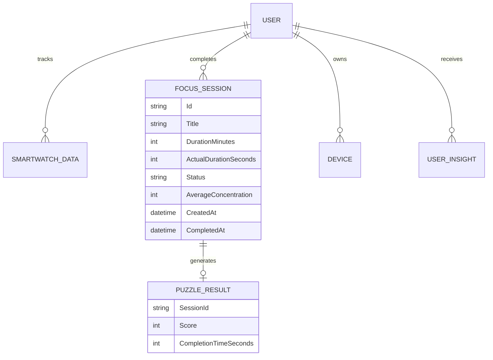

# Mobile Backend API (.NET Core)

The `HazeClue_backend_mobile` repository contains the robust API that serves the Flutter mobile application. It is responsible for data persistence, security, and complex business logic.

## Architecture & Stack
- **Framework:** ASP.NET Core Web API (C#)
- **Database:** Entity Framework Core (SQL Server / PostgreSQL)
- **Authentication:** JWT (JSON Web Tokens)
- **Architecture Pattern:** N-Tier / Clean Architecture principles (Core, Infrastructure, UI/API layers).

## Core API Controllers

The API exposes several endpoints under the `/api/v1` route, heavily secured by `[Authorize]` attributes and JWT claims.

### 1. SessionsController (`v1/SessionsController.cs`)
Handles all focus session logic and analytics. 
- **`GET /Sessions`**: Retrieves all sessions for the authenticated user, ordered descending by `CreatedAt`.
- **`POST /Sessions`**: Creates a new session (`FocusSession` entity) linked to a `DeviceId`, defaulting to `"active"` status.
- **`POST /Sessions/{id}/complete`**: Marks a session as `"completed"`. It saves `AverageConcentration` and `ActualDurationSeconds`. **Crucially**, it also triggers an automatic `AppNotification` creation (e.g., "Session Completed! 🎉 Great job...").
- **`POST /Sessions/{id}/score`**: Submits a `PuzzleScoreDto` creating a `PuzzleResult` entity tied to the session.
- **`GET /Sessions/insights`**: Contains massive aggregation logic. It calculates:
  - `totalFocusSeconds` and `averageMinutesPerDay`.
  - `weeklyData` array by summing `ActualDurationSeconds` for the past 7 days individually.
  - Computes `improvementPercentage` by comparing the current 7 days vs the previous 7 days (Days 7-13).
  - `monthlyData` array by aggregating the last 6 months dynamically.

### 2. SmartwatchController
Ingests health metrics from the mobile device (Sleep, HRV, Stress).

### 3. InsightsController & AssessmentsController
Responsible for generating automated health tips and retrieving personalized assessments based on the latest uploaded physiological data.

## Core Entities



## Security & State Management
The backend relies entirely on ASP.NET Identity and Claims. Every controller extracts the user context securely using:
```csharp
var userId = User.FindFirstValue(ClaimTypes.NameIdentifier);
```
This ensures zero cross-tenant data leakage.
