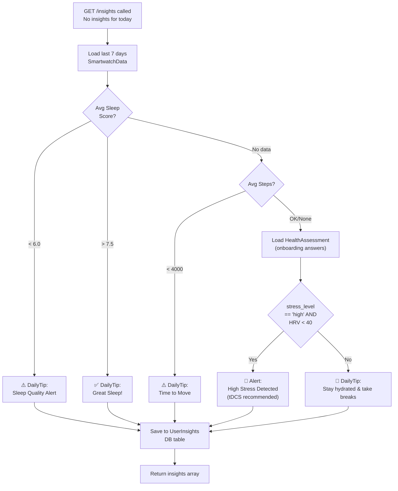

# Insights & Notifications — Mobile Backend

> 🔒 All endpoints require `Authorization: Bearer <token>`

## AI Insights Engine

The Insights module generates **rule-based, personalized health tips** by analyzing the user's latest smartwatch data and health assessment responses. Insights are generated lazily — only when the user requests them and none exist for today.

**Base path:** `/api/v1/insights`

### Insight Types

| Type | Description |
|------|-------------|
| `DailyTip` | General wellness recommendation |
| `Alert` | Urgent intervention needed (e.g., high stress detected) |
| `Achievement` | Positive reinforcement (e.g., great sleep streak) |

### `GET /api/v1/insights` 🔒

Returns today's insights for the user. If none exist, **automatically generates new ones** before responding.

**Response:**
```json
[
  {
    "id": "...",
    "type": "Alert",
    "title": "High Stress Detected",
    "message": "Based on your initial assessment and your recent HRV, your body is experiencing high stress. A short tDCS or Focus session is highly recommended.",
    "createdAt": "2026-05-29T00:00:00Z"
  },
  {
    "id": "...",
    "type": "DailyTip",
    "title": "Time to Move",
    "message": "Your daily activity is a bit low this week. Even a 15-minute walk can boost your focus and mood!",
    "createdAt": "2026-05-29T00:00:00Z"
  }
]
```

### Insight Generation Rules

The engine applies 3 rule sets in order, with a fallback tip if no rules trigger:



**Implementation:**
```csharp
// Rule 1: Sleep Analysis
var avgSleep = watchData.Where(d => d.SleepScore != null).Average(d => d.SleepScore);
if (avgSleep < 6.0) → "Sleep Quality Alert"
if (avgSleep > 7.5) → "Great Sleep!"

// Rule 2: Physical Activity
var avgSteps = watchData.Where(d => d.Steps != null).Average(d => d.Steps);
if (avgSteps < 4000) → "Time to Move"

// Rule 3: Cross-Domain Stress Detection
// Combines HealthAssessment JSON + HRV measurement
if (assessment.stress_level == "high" && avgHrv < 40)
  → "High Stress Detected" (Alert type)

// Fallback
if (!insights.Any()) → "Daily Health Tip" (hydration reminder)
```

---

## Assessments API

**Base path:** `/api/v1/assessments`

### `POST /api/v1/assessments/health`

Submits the user's initial health assessment answers (completed during onboarding). The JSON payload is stored as a flexible blob.

**Request body:**
```json
{
  "stress_level": "high",
  "sleep_quality": "poor",
  "physical_activity": "sedentary",
  "cognitive_goals": ["focus", "memory"],
  "medical_conditions": []
}
```

Used by: `personal_health_assessment.dart` → `ApiService.submitHealthAssessment(data)`

---

### `POST /api/v1/assessments/tdcs-consent`

Records the user's explicit tDCS consent (must be completed before any neurostimulation session).

**Request body:**
```json
{
  "consentGiven": true,
  "acknowledgedRisks": true,
  "timestamp": "2026-05-29T14:00:00Z"
}
```

Used by: `tdcs_consent_screen.dart` → `ApiService.submitTdcsConsent(data)`

::: warning Medical Safety
tDCS (transcranial Direct Current Stimulation) involves applying mild electrical current to the scalp. The consent screen displays the full safety information before the user can proceed. This consent record is stored permanently and is not reversible via the app.
:::

---

## Notifications API

**Base path:** `/api/v1/notifications`

### Notification Entity

| Field | Type | Description |
|-------|------|-------------|
| `Id` | `string (GUID)` | Auto-generated |
| `UserId` | `string` | FK → AppUser |
| `Title` | `string` | Notification title |
| `Message` | `string` | Full notification body |
| `IsRead` | `bool` | Default: `false` |
| `CreatedAt` | `DateTime` | Auto-generated |

### Endpoints

| Method | Endpoint | Description |
|--------|----------|-------------|
| `GET` | `/notifications` | Get all notifications (newest first) |
| `POST` | `/notifications` | Create a notification (internal use) |
| `PATCH` | `/notifications/{id}/read` | Mark a single notification as read |
| `PATCH` | `/notifications/read-all` | Mark all unread notifications as read |

### Auto-Generated Notifications

Sessions automatically create notifications on `complete`:

```csharp
var notification = new AppNotification
{
    UserId = userId,
    Title = "Session Completed! 🎉",
    Message = $"Great job! You just completed a focus session lasting {durationText} " +
              $"with an average concentration of {dto.AverageConcentration}%.",
    IsRead = false,
    CreatedAt = DateTime.UtcNow
};
```

**From Flutter:**
```dart
// Fetch all notifications
final notifications = await ApiService.getNotifications();

// Mark one as read
await ApiService.markNotificationRead(notificationId);

// Mark all as read
await ApiService.markAllNotificationsRead();
```
