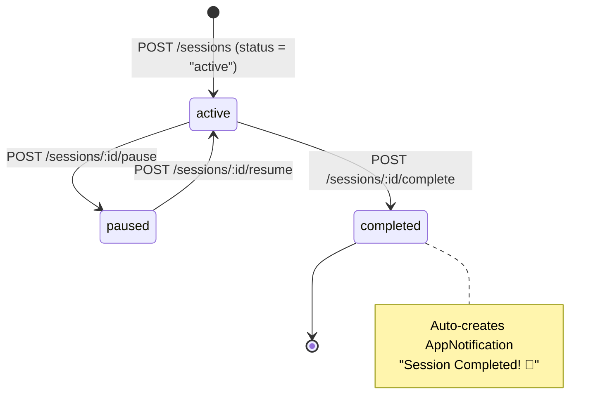

# Sessions API — Mobile Backend

> 🔒 All endpoints require `Authorization: Bearer <token>`  
> **Base path:** `/api/v1/sessions/...`

The Sessions module is the core of the mobile experience. A `FocusSession` is created when the user starts any cognitive training activity (tDCS, memory game, concentration puzzle). Sessions track duration, concentration scores, and generate notifications on completion.

## Session Lifecycle



## FocusSession Entity

| Field | Type | Description |
|-------|------|-------------|
| `Id` | `string (GUID)` | Auto-generated |
| `UserId` | `string` | FK → AppUser, indexed |
| `DeviceId` | `string?` | FK → Device (BCI/EEG device used) |
| `Title` | `string` | Session title (e.g., "Focus Session") |
| `DurationMinutes` | `int` | Planned duration in minutes |
| `ActualDurationSeconds` | `int` | Actual elapsed seconds (set on complete) |
| `Status` | `string` | `active` · `paused` · `completed` |
| `AverageConcentration` | `int` | Final avg EEG concentration % (0–100) |
| `CreatedAt` | `DateTime` | Session start timestamp |
| `CompletedAt` | `DateTime?` | Session end timestamp |

## Endpoints

### `GET /api/v1/sessions`

Returns all sessions for the authenticated user, ordered by `CreatedAt DESC`.

**Response:**
```json
[
  {
    "id": "abc123",
    "title": "Morning Focus Session",
    "durationMinutes": 20,
    "actualDurationSeconds": 1187,
    "status": "completed",
    "averageConcentration": 72,
    "createdAt": "2026-05-29T08:00:00Z",
    "completedAt": "2026-05-29T08:19:47Z"
  }
]
```

---

### `POST /api/v1/sessions`

Creates a new session with `status: "active"`.

**Request body:**
```json
{
  "title": "tDCS Focus Session",
  "durationMinutes": 20,
  "deviceId": "device-guid-here"
}
```

::: tip From Flutter
```dart
final session = await ApiService.createSession(
  "tDCS Focus Session",
  20,
  selectedDevice?.id,
);
```
:::

---

### `POST /api/v1/sessions/:id/complete`

Marks the session as `completed`. Saves actual duration and average EEG concentration.

**Side effect:** Automatically creates an `AppNotification`:
> **"Session Completed! 🎉"**  
> "Great job! You just completed a focus session lasting 19 minutes with an average concentration of 72%."

**Request body:**
```json
{
  "averageConcentration": 72,
  "actualDurationSeconds": 1187
}
```

**From Flutter:**
```dart
await ApiService.completeSession(sessionId, avgConcentration, actualSeconds);
```

---

### `POST /api/v1/sessions/:id/pause`

Sets session status to `"paused"`.

---

### `POST /api/v1/sessions/:id/resume`

Sets session status back to `"active"`.

---

### `POST /api/v1/sessions/:id/score`

Submits a cognitive game puzzle score tied to the session. Creates a `PuzzleResult` entity.

**Request body:**
```json
{
  "score": 850,
  "completionTimeSeconds": 45
}
```

**From Flutter:**
```dart
await ApiService.submitSessionScore(sessionId, score, completionTimeSeconds);
```

---

### `GET /api/v1/sessions/insights`

**The analytics endpoint.** Returns comprehensive aggregated performance data powering the Insights screen in Flutter.

**Algorithm:**

```csharp
// 1. Total focus time
int totalFocusSeconds = sessions.Sum(s => s.ActualDurationSeconds);

// 2. Average per active day
var activeDaysCount = sessions.Select(s => s.CreatedAt.Date).Distinct().Count();
var averageMinutesPerDay = totalFocusMinutes / activeDaysCount;

// 3. Weekly data (last 7 days, per-day minutes)
for (int i = 6; i >= 0; i--) {
    var targetDate = DateTime.UtcNow.Date.AddDays(-i);
    var dailyMinutes = sessions
        .Where(s => s.CreatedAt.Date == targetDate)
        .Sum(s => s.ActualDurationSeconds) / 60;
    weeklyData.Add(dailyMinutes);
}

// 4. Improvement % (current 7 days vs previous 7 days)
improvementPercentage = (currentWeekSeconds - lastWeekSeconds) / lastWeekSeconds * 100;
// Special case: if lastWeek = 0 but currentWeek > 0 → 100% improvement

// 5. Monthly data (last 6 months, per-month minutes)
for (int i = 5; i >= 0; i--) {
    var targetMonth = DateTime.UtcNow.Date.AddMonths(-i);
    monthlyData.Add(monthlySumMinutes);
}
```

**Response:**
```json
{
  "totalFocusSeconds": 87400,
  "averageMinutesPerDay": 20,
  "overallAverageConcentration": 74,
  "totalSessionsCount": 48,
  "improvementPercentage": 12,
  "weeklyData": [15, 22, 10, 30, 18, 25, 20],
  "monthlyData": [420, 580, 640, 720, 695, 812]
}
```

## PuzzleResult Entity

| Field | Type | Description |
|-------|------|-------------|
| `Id` | `string (GUID)` | Auto-generated |
| `SessionId` | `string` | FK → FocusSession |
| `Score` | `int` | Cognitive game score |
| `CompletionTimeSeconds` | `int` | Time taken to complete puzzle |
| `CreatedAt` | `DateTime` | Auto-generated |
