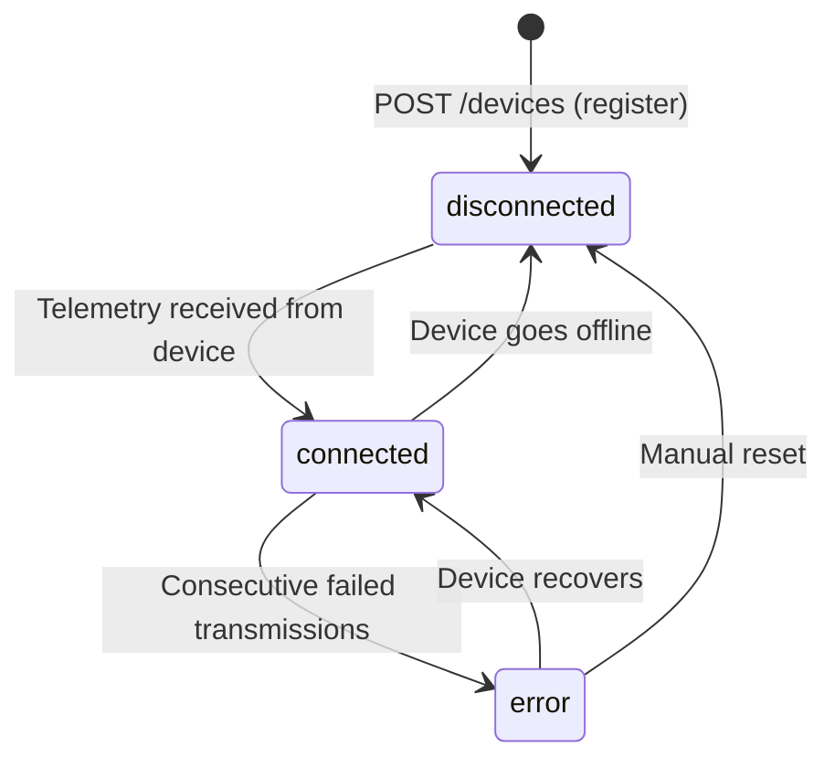

# Devices API

> 🔒 All endpoints require `Authorization: Bearer <token>`

The Devices module manages the EEG and BCI headsets registered by instructors. Each device is scoped to the owning instructor and tracks its last-seen timestamp and connection status.

**Base path:** `/api/devices`

## Device Schema

| Field | Type | Description |
|-------|------|-------------|
| `_id` | `ObjectId` | Auto-generated |
| `user` | `ObjectId → User` | Owning instructor, indexed |
| `name` | `string` | Display name (e.g., "Classroom EEG Set A") |
| `type` | `EEG \| BCI` | Device category |
| `serialNumber` | `string` | Hardware serial number |
| `status` | `connected \| disconnected \| error` | Default: `disconnected` |
| `lastSeen` | `Date?` | Last telemetry timestamp |
| `createdAt` | `Date` | Auto-generated |

**Database Indexes:**
- `(user, serialNumber)` — unique compound (prevents duplicate registration)
- `(user, status)` — fast status filtering per instructor

## Endpoints

### `GET /api/devices`

List all devices registered by the authenticated instructor.

**Response:**
```json
{
  "data": [
    {
      "_id": "6650a1b2c3d4e5f6a7b8c9d0",
      "name": "Classroom EEG Set A",
      "type": "EEG",
      "serialNumber": "MSE-2024-001",
      "status": "connected",
      "lastSeen": "2026-05-29T14:20:00.000Z"
    }
  ],
  "status": 200,
  "message": "Success"
}
```

---

### `POST /api/devices`

Register a new EEG or BCI device.

**Request body:**
```json
{
  "name": "Classroom EEG Set A",
  "type": "EEG",
  "serialNumber": "MSE-2024-001"
}
```

::: warning Unique Constraint
A `(user, serialNumber)` unique index prevents the same device from being registered twice by the same instructor. Returns `409 Conflict` on duplicate.
:::

---

### `GET /api/devices/:id`

Get details for a specific device (must belong to the authenticated instructor).

---

### `PATCH /api/devices/:id`

Update device metadata (name, type) or status.

**Request body:**
```json
{
  "name": "Classroom EEG Set A — Row 1",
  "status": "disconnected"
}
```

---

### `DELETE /api/devices/:id`

Remove a device registration. Does not affect historical telemetry data linked to this device.

## Device Status Flow



## Telemetry Integration

When a BCI device sends EEG data, it hits the `POST /api/telemetry` endpoint (not a device endpoint). The Telemetry Controller then:

1. Persists the data point to MongoDB
2. Updates `device.lastSeen` timestamp
3. Triggers a Pusher event on the session channel

→ See [Real-Time (Pusher)](/docs/backend-web/realtime) for full telemetry details.
