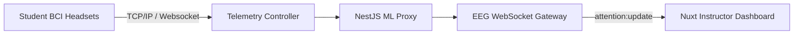

# Web Application & Instructor Platform (Vue.js / Nuxt / NestJS)

The web ecosystem of HazeClue is divided into two deeply integrated repositories: `Haze_clue_website` (Nuxt 4 Frontend) and `haze_clue_backend_web` (NestJS Backend). This platform is designed specifically for **Educational Institutions and Instructors** to monitor student engagement in real-time.

## The NestJS Backend API

Built on NestJS and MongoDB, the backend is highly modular and utilizes real-time WebSockets for telemetry.

### Module Architecture (`src/`)

1. **Gateway Module (`eeg.gateway.ts`)**
   - Implements Socket.IO to broadcast raw EEG telemetry and calculated attention scores in real time. 
   - Uses `session:join` to group sockets into specific classroom sessions, and `attention:update` to push live data to instructor dashboards.
2. **Telemetry Controller (`telemetry.controller.ts`)**
   - Ingests high-frequency data streams.
3. **Sessions & Reports**
   - Mongoose schemas track complex educational sessions (`students` count, `className`, `duration`).
   - Reports generate `{ avgAttention, peakAttention, timeline[] }` for post-session heatmaps.

## The Nuxt 4 Frontend

The instructor portal uses Nuxt 4 with a strictly typed Pinia and `$customFetch` integration.

### Application Flow & Views (`app/pages/`)
- **Authentication:** Features robust OTP flows (`verify.vue`, `forgot-password.vue`, `reset-password.vue`).
- **Dashboard (`/dashboard`):** 
  - `sessions/create.vue`: A multi-step wizard for instructors to schedule or instantiate live monitoring sessions.
  - `live-session.vue`: The crown jewel of the web platform. Consumes the WebSocket data to render real-time Chart.js instances showing the aggregated attention spans of the class.
  - `reports.vue`: Displays post-session analytical heatmaps.

### State & API Abstraction
- The `$customFetch` plugin (`app/plugins/customFetch.ts`) intercepts every API call, injecting `Authorization` headers, `Accept-Language` headers for robust i18n, and deduplicating requests automatically.
- Pinia stores (`stores/auth.ts`) persist instructor tokens across SSR environments cleanly via `useCookie`.

### Build Optimizations
The system employs extreme chunking via `vendor` specific builds:
- `vendor-i18n`, `vendor-charts`, `vendor-reka-ui` are split aggressively to ensure the massive dashboard loads within milliseconds.
