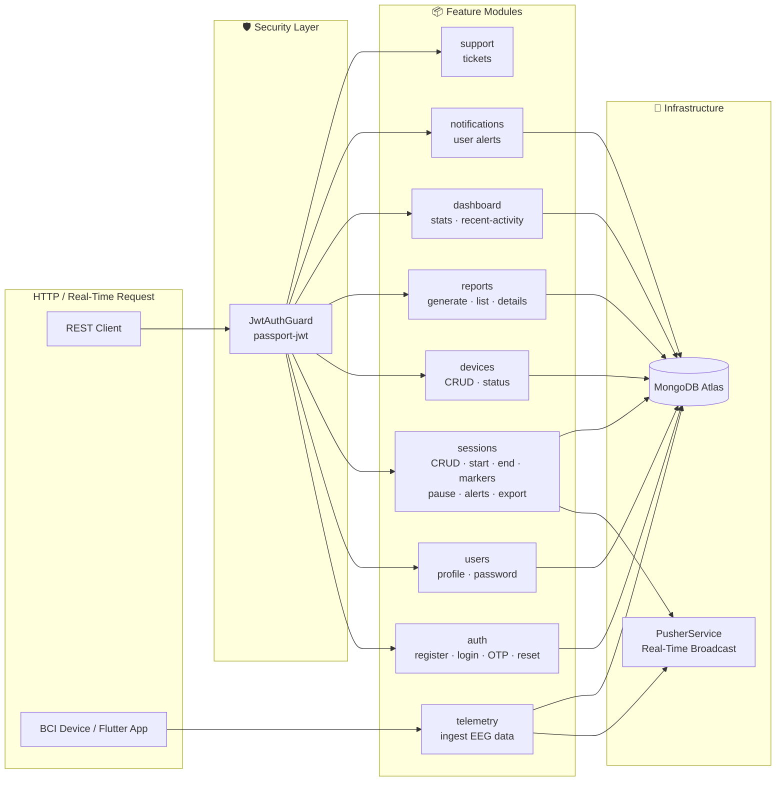

# Web Backend — NestJS API

> **Repository:** [`HazeClue/Haze_clue_backend`](https://github.com/HazeClue/Haze_clue_backend)  
> **Production URL:** `https://haze-clue-backend.vercel.app/api`  
> **Postman Collection:** [HazeClue_API_Postman_Collection.json](https://github.com/HazeClue/Haze_clue_backend/blob/main/HazeClue_API_Postman_Collection.json)

The HazeClue Web Backend is a **production-grade NestJS 11 API** that powers the instructor-facing web platform. It manages the full lifecycle of EEG monitoring sessions, handles instructor authentication, ingests real-time device telemetry, and broadcasts live attention data to instructor dashboards via **Pusher**.

## Tech Stack

| Layer | Technology | Version |
|-------|-----------|---------|
| **Framework** | NestJS (Express adapter) | 11.x |
| **Language** | TypeScript (strict mode) | 5.x |
| **Database** | MongoDB via Mongoose | 7.x / 8.x |
| **Auth** | JWT via `@nestjs/jwt` + `passport-jwt` | Latest |
| **Password Hashing** | bcryptjs | 6.x |
| **Validation** | `class-validator` + `class-transformer` | Latest |
| **Real-Time** | Pusher Server SDK | Latest |
| **Config** | `@nestjs/config` (dotenv) | Latest |
| **Email** | Nodemailer (SMTP) | Latest |
| **PDF Export** | PDFKit | Latest |
| **Package Manager** | pnpm | 10.x |
| **Runtime** | Node.js | 22.x |
| **Deployment** | Vercel (Serverless) | — |

## Module Architecture

Every feature lives in its own NestJS module following the **Controller → Service → Mongoose Model** pattern:



## Project Structure

```
src/
├── main.ts                     # Bootstrap: CORS, global prefix /api, port 3001
├── app.module.ts               # Root module: Config, Mongoose, feature modules
│
├── common/                     # ✦ Shared Infrastructure
│   ├── decorators/
│   │   └── current-user.decorator.ts   # @CurrentUser() → extracts userId from JWT
│   ├── guards/
│   │   └── jwt-auth.guard.ts           # JwtAuthGuard (applies to all protected routes)
│   ├── filters/
│   │   └── http-exception.filter.ts    # Global exception → consistent error envelope
│   └── dto/
│       ├── api-response.dto.ts         # { data, status, message }
│       └── paginated-response.dto.ts   # Pagination + links + meta
│
├── auth/                       # Authentication (register, login, OTP, reset)
├── users/                      # User profile management
├── sessions/                   # Session lifecycle + real-time management
├── devices/                    # EEG/BCI device registration
├── reports/                    # Post-session analytics reports
├── dashboard/                  # Aggregated stats + recent activity
├── gateway/                    # Telemetry ingestion controller
├── pusher/                     # Pusher real-time service
├── notifications/              # User notification management
├── lookups/                    # Lookup data (roles, types, etc.)
└── support/                    # Support ticket system
```

## Request Lifecycle

```
HTTP Request
    │
    ▼
Global Validation Pipe (class-validator)
    │
    ▼
JwtAuthGuard (passport-jwt strategy)
    │
    ▼
Controller → @CurrentUser() decorator injects userId
    │
    ▼
Service (business logic)
    │
    ▼
Mongoose Model → MongoDB Atlas
    │
    ▼
Global Exception Filter → { data, status, message }
```

## Standard Response Envelope

All endpoints return a consistent JSON envelope:

```json
{
  "data": { ... },
  "status": 200,
  "message": "Success"
}
```

Paginated endpoints add `links` and `meta`:

```json
{
  "data": [ ... ],
  "status": 200,
  "message": "Success",
  "meta": {
    "current_page": 1,
    "last_page": 5,
    "per_page": 10,
    "total": 50
  },
  "links": {
    "first": "/api/sessions?page=1",
    "last": "/api/sessions?page=5",
    "prev": null,
    "next": "/api/sessions?page=2"
  }
}
```

## Quick Navigation

| Section | Description |
|---------|-------------|
| [Authentication](/docs/backend-web/authentication) | Register, Login, OTP flows, Password reset, OAuth |
| [Sessions API](/docs/backend-web/sessions) | Full session CRUD, lifecycle, markers, exports |
| [Devices API](/docs/backend-web/devices) | EEG/BCI device registration and management |
| [Reports & Dashboard](/docs/backend-web/reports) | Analytics, PDF/CSV export, dashboard stats |
| [Real-Time (Pusher)](/docs/backend-web/realtime) | Live telemetry ingestion and event broadcasting |
| [Deployment & Env](/docs/backend-web/deployment) | Environment variables, Vercel config, local setup |
