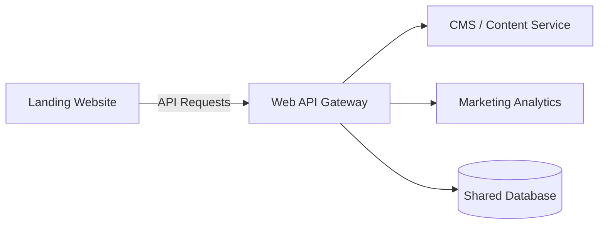

# Web Backend API

The `haze_clue_backend_web` repository contains the services utilized by the administrative dashboard and the public marketing website.

## Overview
While the Mobile Backend focuses heavily on individual user physiological data and high-frequency cognitive sessions, the Web Backend is designed to handle organizational features, broad analytics, and marketing integrations.

## Potential Architecture
*Note: This architecture depends on the specific stack chosen for the web backend (Node.js, Express, Python, etc.).*

## Key Responsibilities
- **Content Management:** Serving dynamic content to the Vue/Nuxt landing page.
- **Lead Generation:** Capturing newsletter signups and early access requests.
- **Organization Dashboards:** Providing aggregated, anonymized insights for corporate wellness partners.
