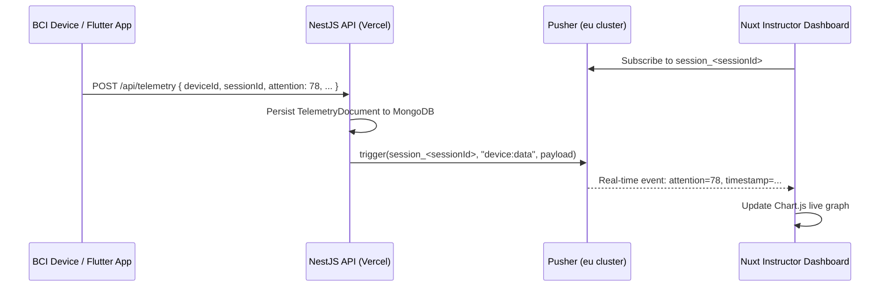

# Real-Time Telemetry (Pusher)

HazeClue uses **Pusher** to deliver real-time EEG telemetry from BCI devices to the instructor dashboard, replacing a traditional WebSocket server with a hosted, scalable, serverless-compatible solution.

## Why Pusher?

The NestJS backend is deployed on **Vercel** (serverless). Long-running WebSocket connections are incompatible with serverless functions that terminate after each invocation. Pusher acts as a dedicated real-time messaging infrastructure, receiving triggers from the NestJS API and pushing events to all subscribed browser clients.



## Pusher Configuration

| Config | Value |
|--------|-------|
| **App ID** | `2158304` |
| **Key** | `aa0fca879ef3879464ff` |
| **Cluster** | `eu` |
| **TLS** | `true` (always enforced) |

## Telemetry Endpoint

### `POST /api/telemetry`

::: info Public Endpoint
This endpoint does **not** require JWT authentication — it is designed to receive data from embedded BCI hardware that may not have a user token.
:::

**Request body:**
```json
{
  "deviceId": "MSE-2024-001",
  "sessionId": "6650a1b2c3d4e5f6a7b8c9d0",
  "attention": 78,
  "meditation": 62,
  "delta": 820000,
  "theta": 334000,
  "alpha": 540000,
  "beta": 280000,
  "gamma": 95000
}
```

| Field | Type | Required | Description |
|-------|------|----------|-------------|
| `deviceId` | `string` | ✅ | Hardware serial / device ID |
| `sessionId` | `string` | ❌ | If provided, routes to session channel |
| `attention` | `number` | ✅ | Computed attention score (0–100) |
| `meditation` | `number` | ❌ | Computed meditation score |
| `delta` | `number` | ❌ | Delta band power (µV²) |
| `theta` | `number` | ❌ | Theta band power (µV²) |
| `alpha` | `number` | ❌ | Alpha band power (µV²) |
| `beta` | `number` | ❌ | Beta band power (µV²) |
| `gamma` | `number` | ❌ | Gamma band power (µV²) |

**Response `200 OK`:**
```json
{
  "success": true,
  "message": "Telemetry data received and broadcasted"
}
```

## Pusher Channel Strategy

| Condition | Channel | Event |
|-----------|---------|-------|
| `sessionId` provided | `session_{sessionId}` | `device:data` |
| No `sessionId` | `device_{deviceId}` | `device:data` |
| Session alert triggered | `session_{sessionId}` | `alert` |
| Session ended | `session_{sessionId}` | `session:end` |

## Pusher Payload (Event: `device:data`)

```json
{
  "deviceId": "MSE-2024-001",
  "attention": 78,
  "meditation": 62,
  "timestamp": "2026-05-29T14:30:00.123Z"
}
```

## Frontend Integration (Nuxt 4)

The instructor dashboard subscribes to the session channel using `pusher-js`:

```typescript
// Nuxt composable / plugin
import Pusher from 'pusher-js'

const pusher = new Pusher('aa0fca879ef3879464ff', { cluster: 'eu' })
const channel = pusher.subscribe(`session_${sessionId}`)

channel.bind('device:data', (payload: TelemetryPayload) => {
  // Update Chart.js with new attention data point
  attentionChart.data.datasets[0].data.push(payload.attention)
  attentionChart.update()
})

channel.bind('session:end', () => {
  // Redirect to report view
  router.push(`/dashboard/reports/${sessionId}`)
})
```

## Simulation Mode

When `USE_SIMULATION=true` is set in environment variables, the backend auto-generates synthetic attention data for testing without real hardware. The frontend drives this via the `POST /api/sessions/:id/tick` endpoint, which triggers one simulation step and fires the Pusher event — keeping the serverless architecture fully functional in a demo environment.

::: tip USE_SIMULATION
Perfect for demos and the graduation presentation! Set this in your `.env` to show a live attention dashboard without needing physical EEG devices connected.
:::
