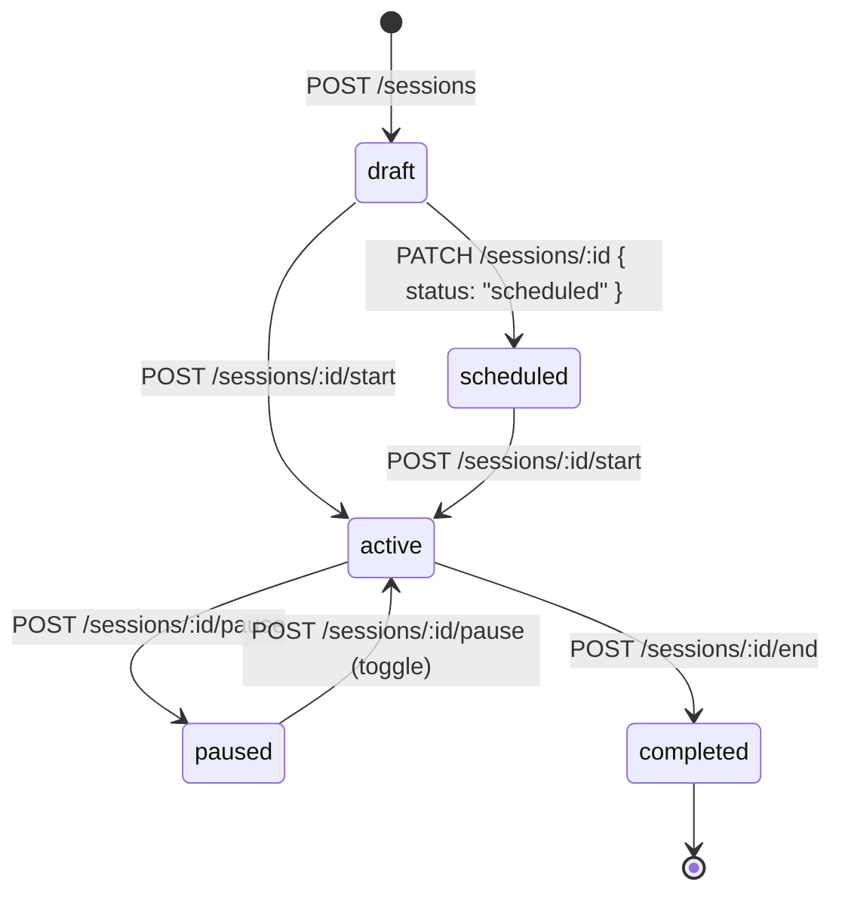

# Sessions API

> 🔒 All endpoints require `Authorization: Bearer <token>`

Sessions are the core data model of the HazeClue web platform. An instructor creates a session, starts it to begin live EEG monitoring, and ends it to generate a finalized report.

**Base path:** `/api/sessions`

## Session Lifecycle



## Session Schema

| Field | Type | Description |
|-------|------|-------------|
| `_id` | `ObjectId` | Auto-generated MongoDB ID |
| `user` | `ObjectId → User` | Owner instructor, indexed |
| `title` | `string` | Required session title |
| `className` | `string` | Class or group name |
| `subject` | `string` | Subject being taught |
| `duration` | `number` | Planned duration in minutes |
| `students` | `number` | Expected number of students |
| `status` | `draft \| scheduled \| active \| completed` | Default: `draft` |
| `monitoringSettings` | `{ attentionTracking, alerts, recording }` | Boolean flags |
| `notes` | `string?` | Optional instructor notes |
| `markers` | `Array<{ label, timestamp }>` | Real-time event markers |
| `startedAt` | `Date?` | When session was activated |
| `endedAt` | `Date?` | When session was completed |
| `createdAt` | `Date` | Auto-generated |
| `updatedAt` | `Date` | Auto-generated |

**Database Indexes:** `(user, createdAt)` compound · `status`

## Endpoints

### `GET /api/sessions`

List all sessions for the authenticated instructor, with pagination and optional status filtering.

**Query params:**

| Param | Type | Default | Description |
|-------|------|---------|-------------|
| `page` | `number` | `1` | Page number |
| `limit` | `number` | `10` | Items per page (max: 50) |
| `status` | `string` | — | Filter by status (`draft`, `active`, etc.) |

**Example:** `GET /api/sessions?page=1&limit=10&status=completed`

---

### `POST /api/sessions`

Create a new session in `draft` status.

**Request body:**
```json
{
  "title": "Advanced Mathematics — Group A",
  "className": "Grade 11 - Section A",
  "subject": "Mathematics",
  "duration": 50,
  "students": 25,
  "monitoringSettings": {
    "attentionTracking": true,
    "alerts": true,
    "recording": true
  },
  "notes": "Focus on exam preparation materials"
}
```

---

### `GET /api/sessions/:id`

Get full details of a single session by ID (must belong to the authenticated instructor).

---

### `PATCH /api/sessions/:id`

Update session metadata (title, class name, monitoring settings, etc.). Cannot be used to change `status` directly — use the lifecycle endpoints below.

---

### `DELETE /api/sessions/:id`

Soft-delete a session. Returns `{ message: "Session deleted" }`.

---

### `POST /api/sessions/:id/start`

Transition the session from `draft` or `scheduled` → `active`. Sets `startedAt` to `now()`.

```json
// Response: updated session object with status: "active"
```

---

### `POST /api/sessions/:id/end`

Transition the session from `active` → `completed`. Sets `endedAt` to `now()`.

---

### `POST /api/sessions/:id/pause`

**Toggle** pause state on an active session. Calling this endpoint twice will unpause the session.

---

### `POST /api/sessions/:id/markers`

Add a timestamped marker to the session (e.g., "Student question", "Topic change").

**Request body:**
```json
{ "label": "Topic change: Derivatives" }
```

---

### `POST /api/sessions/:id/alert`

Broadcast an alert message to all connected clients in the session's Pusher channel.

**Request body:**
```json
{ "message": "Please focus — attention levels dropping!" }
```


---

### `GET /api/sessions/:id/live-data`

Returns the current live telemetry snapshot for a session (class average attention, connected devices, per-student data).

**Response:**
```json
{
  "type": "attention_update",
  "timestamp": "2026-05-29T14:30:00.000Z",
  "data": {
    "classAvgAttention": 78,
    "connectedDevices": 18,
    "totalDevices": 20,
    "duration": "25:30",
    "remainingTime": null,
    "engagementLevel": "high",
    "perStudent": [
      {
        "deviceId": "dev_abc123",
        "studentName": "Student A",
        "attention": 82
      }
    ]
  }
}
```

---

### `GET /api/sessions/:id/export/pdf`

Generate and stream a **PDF report** for the completed session.

- `Content-Type: application/pdf`
- `Content-Disposition: attachment; filename="session-report-{id}.pdf"`

---

### `GET /api/sessions/:id/export/csv`

Generate and stream a **CSV data export** for the session's telemetry records.

- `Content-Type: text/csv`
- `Content-Disposition: attachment; filename="session-data-{id}.csv"`
