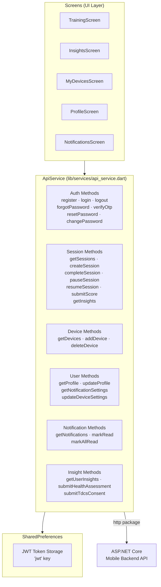

# API Service Layer — Flutter

The `ApiService` class (`lib/services/api_service.dart`) is the **single centralized HTTP client** for the entire Flutter app. All network calls flow through this static class — there is no separate repository layer.

## Architecture



## Base Configuration

```dart
class ApiService {
  // Override at build time:
  // flutter run --dart-define=API_BASE_URL=https://your-api.com/api/v1
  static const String baseUrl = String.fromEnvironment(
    'API_BASE_URL',
    defaultValue: 'http://localhost:5220/api/v1',
  );
}
```

| Environment | Base URL |
|-------------|---------|
| **Development (local)** | `http://localhost:5220/api/v1` |
| **Production** | Set via `--dart-define=API_BASE_URL=...` |

## Token Management

All tokens are stored in `SharedPreferences` under the key `'jwt'`:

```dart
// Save token after login/register
static Future<void> saveToken(String token) async {
  final prefs = await SharedPreferences.getInstance();
  await prefs.setString('jwt', token);
}

// Load token for request headers
static Future<String?> getToken() async {
  final prefs = await SharedPreferences.getInstance();
  return prefs.getString('jwt');
}

// Delete on logout
static Future<void> deleteToken() async {
  final prefs = await SharedPreferences.getInstance();
  await prefs.remove('jwt');
}
```

## Auth Headers Builder

Every protected call uses `_authHeaders()`:

```dart
static Future<Map<String, String>> _authHeaders() async {
  final token = await getToken();
  return {
    'Content-Type': 'application/json',
    if (token != null) 'Authorization': 'Bearer $token',
  };
}
```

## Error Handling

The service extracts error messages from both flat `{ message }` and nested `{ errors: { field: [...] } }` responses:

```dart
static String _extractErrorMessage(Map<String, dynamic> data) {
  if (data['errors'] != null && data['errors'] is Map) {
    // ASP.NET validation errors format
    final errors = data['errors'] as Map<String, dynamic>;
    return errors.values
      .map((v) => v is List ? v.join('\n') : v.toString())
      .join('\n');
  }
  return data['message'] ?? data['title'] ?? 'Request failed';
}
```

Errors are surfaced as `Exception` throws — screens catch these and show `showGlassToast()` feedback.

## Complete API Method Reference

### Auth

| Method | HTTP | Endpoint |
|--------|------|----------|
| `register(name, email, password)` | `POST` | `/account/register` |
| `login(email, password)` | `POST` | `/account/login` |
| `logout()` | `POST` | `/account/logout` |
| `requestPasswordReset(email)` | `POST` | `/account/forgot-password` |
| `verifyOtp(email, otp)` | `POST` | `/account/verify-otp` → returns `resetToken` |
| `resetPassword(email, otp, newPassword)` | `POST` | `/account/reset-password` |
| `changePassword(currentPassword, newPassword)` | `POST` | `/account/change-password` |

### Security & Sessions

| Method | HTTP | Endpoint |
|--------|------|----------|
| `getActiveSessions()` | `GET` | `/account/sessions` |
| `revokeSession(id)` | `DELETE` | `/account/sessions/:id` |
| `revokeOtherSessions()` | `DELETE` | `/account/sessions/other` |
| `getSecurityLogs()` | `GET` | `/account/security-logs` |

### User Profile

| Method | HTTP | Endpoint |
|--------|------|----------|
| `getProfile()` | `GET` | `/users/me` |
| `updateProfile(fullName, ...)` | `PUT` | `/users/me` |
| `getNotificationSettings()` | `GET` | `/users/me/notification-settings` |
| `updateNotificationSettings(settings)` | `PUT` | `/users/me/notification-settings` |
| `getDeviceSettings()` | `GET` | `/users/me/device-settings` |
| `updateDeviceSettings(intensityLevel)` | `PUT` | `/users/me/device-settings` |

### Focus Sessions

| Method | HTTP | Endpoint |
|--------|------|----------|
| `getSessions()` | `GET` | `/sessions` |
| `createSession(title, duration, deviceId)` | `POST` | `/sessions` |
| `completeSession(id, avgConc, actualSecs)` | `POST` | `/sessions/:id/complete` |
| `pauseSession(id)` | `POST` | `/sessions/:id/pause` |
| `resumeSession(id)` | `POST` | `/sessions/:id/resume` |
| `submitSessionScore(id, score, timeSeconds)` | `POST` | `/sessions/:id/score` |
| `getInsights()` | `GET` | `/sessions/insights` |

### Devices

| Method | HTTP | Endpoint |
|--------|------|----------|
| `getDevices()` | `GET` | `/devices` |
| `addDevice(name, macAddress)` | `POST` | `/devices` |
| `deleteDevice(id)` | `DELETE` | `/devices/:id` |

### AI Insights & Notifications

| Method | HTTP | Endpoint |
|--------|------|----------|
| `getUserInsights()` | `GET` | `/insights` |
| `submitHealthAssessment(data)` | `POST` | `/assessments/health` |
| `submitTdcsConsent(data)` | `POST` | `/assessments/tdcs-consent` |
| `getDashboardStats()` | `GET` | `/dashboard/stats` |
| `getNotifications()` | `GET` | `/notifications` |
| `markNotificationRead(id)` | `PATCH` | `/notifications/:id/read` |
| `markAllNotificationsRead()` | `PATCH` | `/notifications/read-all` |
| `submitSupportTicket(subject, msg)` | `POST` | `/support/ticket` |
