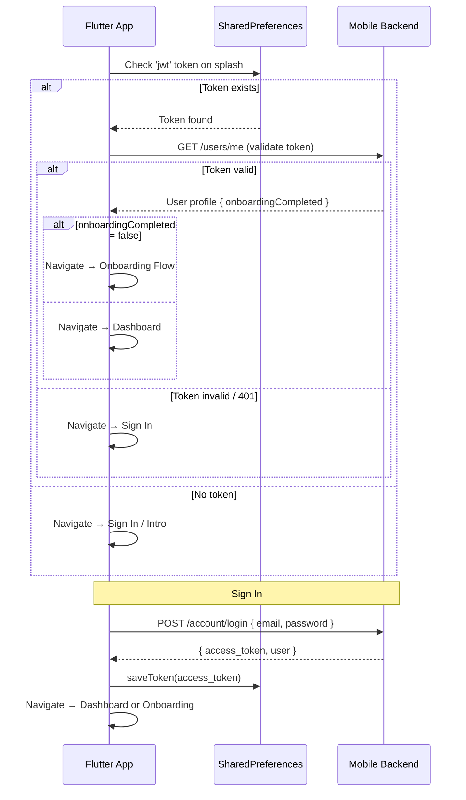

# Auth & Onboarding — Flutter

The Flutter authentication flow uses the ASP.NET Core Mobile Backend and implements a **full onboarding gate** for new users — guiding them through health assessment and tDCS consent before accessing the main dashboard.

## Auth Screens

| Screen File | Purpose |
|-------------|---------|
| `sign_in_screen.dart` | Email + password login |
| `sign_up_screen.dart` | Registration with validation |
| `forgot_password_screen.dart` | Request OTP by email |
| `verify_code_screen.dart` | Enter 6-digit OTP |
| `new_password_screen.dart` | Set new password using OTP |
| `password_changed_successfully.dart` | Success confirmation |
| `splash_screen.dart` | Auto-login check on app start |

## Auth Flow



## Login Implementation

```dart
// sign_in_screen.dart
Future<void> _handleLogin() async {
  try {
    final data = await ApiService.login(
      email: _emailController.text.trim(),
      password: _passwordController.text,
    );
    
    final user = data['user'];
    final onboardingDone = user['onboardingCompleted'] as bool? ?? false;
    
    if (!onboardingDone) {
      // First-time user → health assessment
      Navigator.pushReplacement(context, 
        MaterialPageRoute(builder: (_) => const SurveyIntroScreen()));
    } else {
      Navigator.pushReplacement(context,
        MaterialPageRoute(builder: (_) => const NavigationShell()));
    }
  } catch (e) {
    showGlassToast(context, e.toString());
  }
}
```

## Password Reset Flow

```
forgot_password_screen.dart
    → ApiService.requestPasswordReset(email)
    → POST /account/forgot-password

verify_code_screen.dart (OTP entry)
    → ApiService.verifyOtp(email, otp)
    → POST /account/verify-otp
    ← { message, resetToken }

new_password_screen.dart
    → ApiService.resetPassword(email, otp, newPassword)
    → POST /account/reset-password

password_changed_successfully.dart
    → Navigate to Sign In
```

## Onboarding Gate

New users (`onboardingCompleted = false`) are redirected through:

```
SurveyIntroScreen
    ↓
PersonalHealthAssessmentScreen
    → ApiService.submitHealthAssessment(answers)
    → POST /assessments/health
    ↓
TdcsConsentScreen
    → ApiService.submitTdcsConsent(consentData)
    → POST /assessments/tdcs-consent
    ↓
NavigationShell (main app)
```

### tDCS Consent Screen (`tdcs_consent_screen.dart`)

Displays the full medical safety disclaimer for transcranial Direct Current Stimulation. Users must:
1. Read the full consent document
2. Check the acknowledgment checkbox
3. Tap "I Agree" to proceed

The consent is stored server-side and is mandatory before any stimulation session can begin.

## Account Security Screen (`account_security_screen.dart`)

Provides users with full visibility and control over their security posture:

- **Active Sessions:** Lists all devices with active JWT sessions
  ```dart
  final sessions = await ApiService.getActiveSessions();
  // [{ deviceName, ipAddress, loginTime, isCurrent }, ...]
  ```
  
- **Revoke Sessions:** Remove access from specific devices
  ```dart
  await ApiService.revokeSession(sessionId);
  ```

- **Revoke All Others:** Sign out all devices except the current one
  ```dart
  await ApiService.revokeOtherSessions();
  ```

- **Security Logs:** Recent auth events (logins, password changes)
  ```dart
  final logs = await ApiService.getSecurityLogs();
  // [{ event, createdAt, ipAddress }, ...]
  ```
