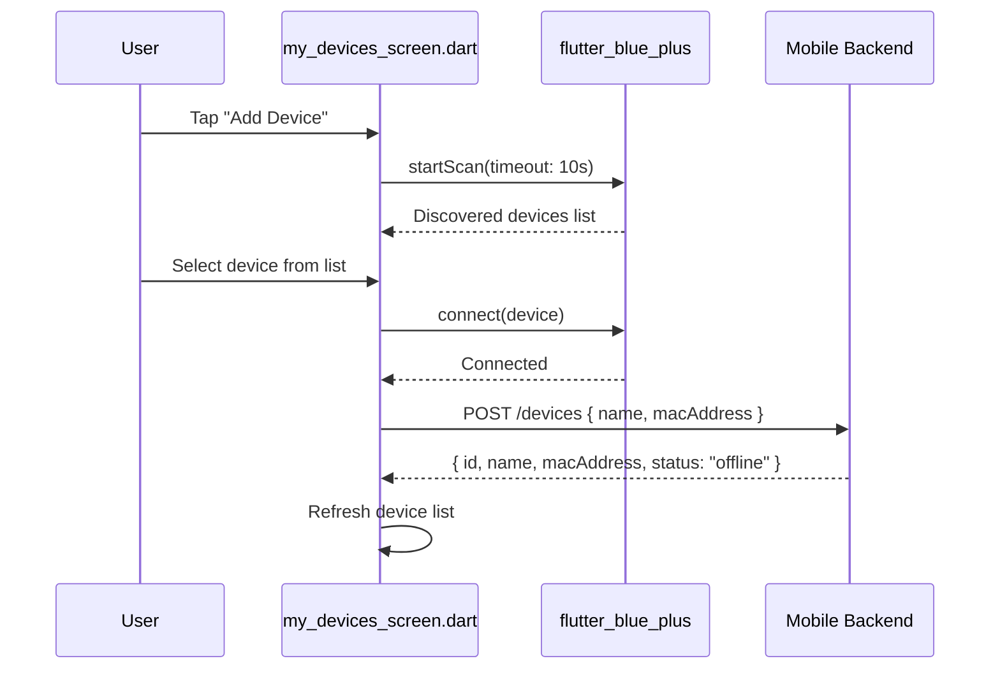
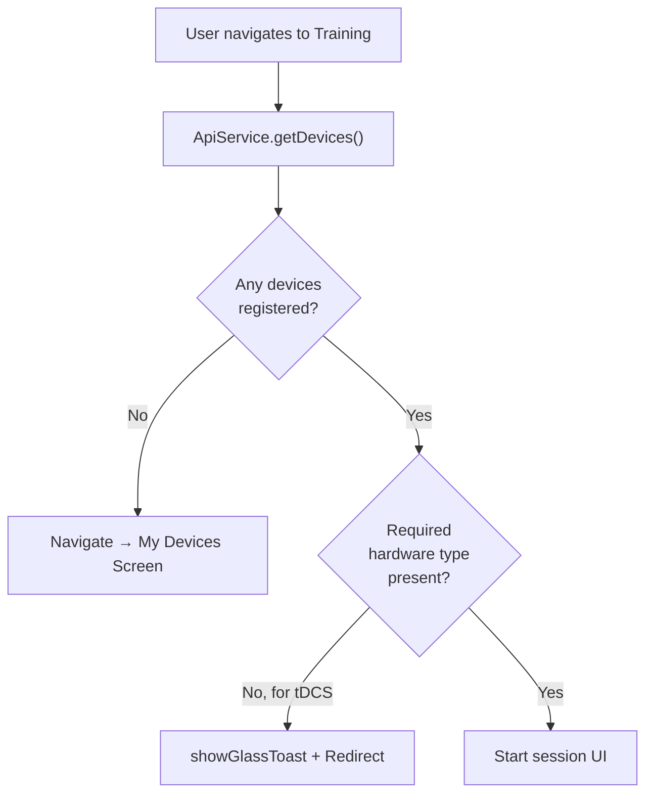

# Devices & BLE — Flutter

**File:** `lib/screens/my_devices_screen.dart`  
**Service:** `lib/services/smartwatch_service.dart` · `lib/services/device_data_service.dart`

The Devices screen manages BLE hardware pairing and tracks the connection status of EEG, tDCS, and smartwatch devices registered to the user.

## Supported Device Categories

| Category | Examples | Connectivity |
|----------|---------|-------------|
| **EEG Headsets** | Muse S (Gen 2), NeuroSky MindWave | BLE |
| **tDCS Stimulators** | Halo Sport, generic tDCS | BLE |
| **Smartwatches** | Apple Watch (HealthKit), Wear OS | Platform API |

## Device Registration Flow



## Device List Screen

```dart
// my_devices_screen.dart
Future<void> _loadDevices() async {
  final devices = await ApiService.getDevices();
  setState(() => _devices = devices);
}

Future<void> _deleteDevice(String id) async {
  await ApiService.deleteDevice(id);
  await _loadDevices(); // Refresh list
}
```

**Device card shows:**
- Device name and MAC address
- Status badge (`online` · `offline`)
- Delete button (with confirmation dialog)

## Training Screen Hardware Gate

Every training-related action starts with a device check:

```dart
// Triggered from TrainingScreen before tDCS
final devices = await ApiService.getDevices();
final hasTdcs = devices.any((d) =>
  d['name'].toLowerCase().contains('tdcs') ||
  d['name'].toLowerCase().contains('halo')
);

if (!hasTdcs) {
  showGlassToast(context, "Please connect a tDCS device first.");
  Navigator.push(context, GlassPageRoute(page: const MyDevicesScreen()));
}
```

## Smartwatch Service (`smartwatch_service.dart`)

Handles reading biometric data from the platform's health API and syncing it to the backend.

```dart
// smartwatch_service.dart
class SmartwatchService {
  // Platform-specific health data reading
  // iOS: HealthKit via health package
  // Android: Health Connect via health package
  
  static Future<void> syncLatestData() async {
    final data = await _readFromPlatformHealth();
    
    await http.post(
      Uri.parse('${ApiService.baseUrl}/smartwatch/sync'),
      headers: await ApiService._authHeaders(),
      body: jsonEncode({
        'heartRate': data.heartRate,
        'hrv': data.hrv,
        'sleepScore': data.sleepScore,
        'steps': data.steps,
        'timestamp': data.timestamp.toIso8601String(),
      }),
    );
  }
}
```

**Data synced to:** `POST /api/v1/smartwatch/sync`

## Device Data Service (`device_data_service.dart`)

Manages real-time EEG data streams from connected BCI hardware over BLE:

```dart
// device_data_service.dart
class DeviceDataService {
  StreamSubscription? _subscription;
  
  void startListening(BluetoothDevice device, Function(EegData) onData) {
    _subscription = device.characteristicValueStream.listen((data) {
      final eegData = EegData.fromBytes(data);
      onData(eegData);
    });
  }
  
  void stop() {
    _subscription?.cancel();
  }
}
```

Raw EEG data from BLE is processed by the on-device ONNX inference engine before being displayed or stored.

## Navigation Guard Pattern

The entire Training module uses devices as an access gate:



## Notification Settings

From `profile_screen.dart` and `notifications_screen.dart`, users can configure what types of notifications they receive:

```dart
// Load settings
final settings = await ApiService.getNotificationSettings();
// { generalNotification, sound, vibrate, appUpdates, serviceAlerts, newTipsAvailable }

// Update
await ApiService.updateNotificationSettings({
  'generalNotification': true,
  'sound': true,
  'vibrate': false,
  'appUpdates': true,
  'serviceAlerts': true,
  'newTipsAvailable': true,
});
```

**API:** `GET/PUT /api/v1/users/me/notification-settings`
