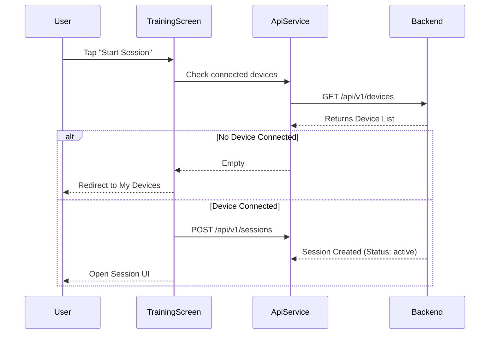

# Mobile Application (Flutter)

The `HazeClue_flutter` repository contains the core user-facing mobile application. It is built using Flutter to provide a deeply integrated, hardware-aware cross-platform experience.

## UI Architecture & Screens

The app leverages a `NavigationShell` pattern to manage primary tabs and complex routing logic.

### 1. Training & Stimulation (`training_screen.dart`, `tdcs_session_screen.dart`)
This is the core functional area of the app. It provides access to:
- **EEG Real-Time Monitoring:** Through `ApiService.getSessions()`.
- **tDCS Simulator:** A fully animated `TdcsSessionScreen` that visualizes trans-cranial electrical stimulation pulses based on dynamic intensity sliders. It manages strict live countdown timers and logs "Focus Sessions" natively.
- **Cognitive Training Games:** Includes a `MemoryTrainingScreen` and a `ConcentrationPuzzleScreen`. At the end of a puzzle, the app triggers a `POST` to `api/v1/sessions/{id}/score` to record cognitive aptitude alongside EEG data.

### 2. Analytics & Insights (`insights_screen.dart`)
The Insights module retrieves aggregated behavioral data. 
- **Time Analytics:** Pulls `totalFocusSeconds`, `averageMinutesPerDay`, and arrays for `weeklyData` and `monthlyData`.
- **Performance Ratios:** Calculates user improvement dynamically (comparing previous week against current week performance).
- **Health Data Fetching:** Integrates a parallel request to `ApiService.getUserInsights()` to present AI-driven personalized health recommendations.

### 3. Hardware Management (`my_devices_screen.dart`)
Manages BLE (Bluetooth Low Energy) pairing and hardware state.
- Supports scanning for multiple mock/real devices including `Muse S (Gen 2)`, `NeuroSky MindWave`, and `Halo Sport (tDCS)`.
- Enforces strict validations: Before starting any tDCS session, the app hard-redirects users to this screen if no compatible device is registered in the backend.

## State Management and API Integration
The app relies on `api_service.dart` to serve as a central HTTP client abstraction. 

## Security & Privacy (`account_security_screen.dart`)
The app integrates multiple privacy-first features:
- In-app password resets.
- Detailed `tdcs_consent_screen.dart` ensuring users legally consent before applying direct electrical current simulations.
- Strict token handling (destroying tokens on logout, refreshing on boot).
