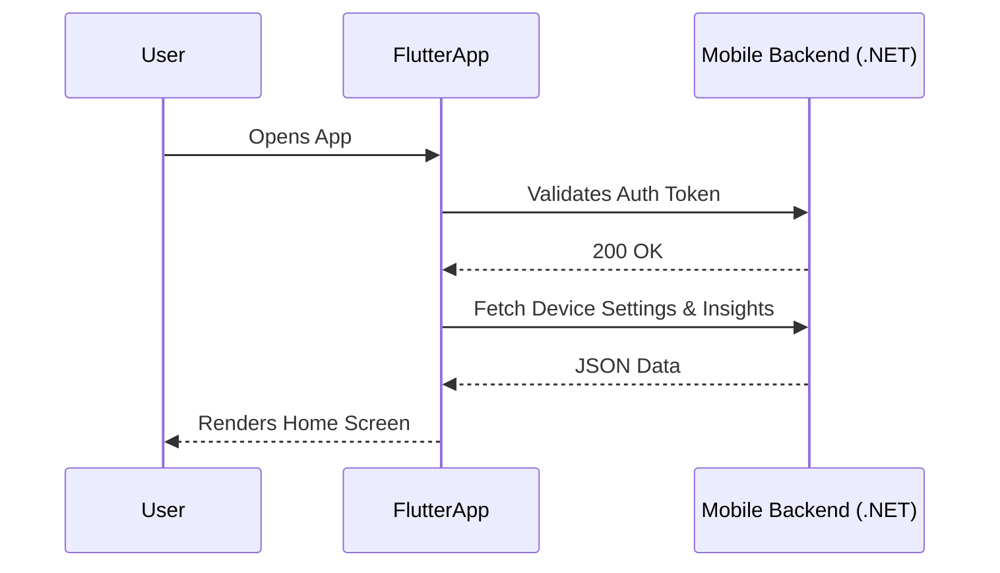

# Mobile Application (Flutter)

The HazeClue mobile application serves as the primary gateway for users to interact with the platform. It provides cognitive training, device management, and detailed insights.

## Technology Stack
- **Framework:** Flutter (Dart)
- **State Management:** Provider / Riverpod (Standardized based on implementation)
- **UI Architecture:** Glassmorphism design system using custom `GlassCard`, `GlassButton`, and `GlassTextField` widgets.

## Key Modules

### 1. Authentication
Handles user registration, login, and secure token storage via `ApiService`. Includes robust form validation.

### 2. Device Management
The `MyDevicesScreen` allows users to scan for and connect Bluetooth devices:
- **EEG Headsets:** (e.g., Muse, NeuroSky)
- **tDCS Devices:** (e.g., Halo Sport)
- **Smartwatches:** Extracts HRV, Sleep, and Stress data via Apple Health / Google Fit APIs.

### 3. Cognitive Training
Provides mini-games such as Concentration Puzzles and Memory Training. 
Integrates with the **tDCS Simulator**, which visually simulates brain stimulation sessions.

### 4. Insights & Analytics
Fetches daily health tips and weekly progress summaries based on both app usage and smartwatch data.

## API Integration Flow

