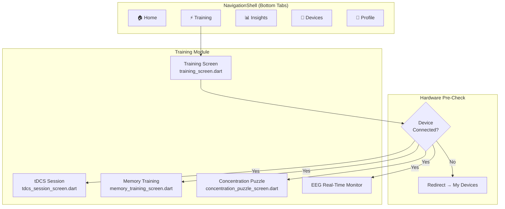
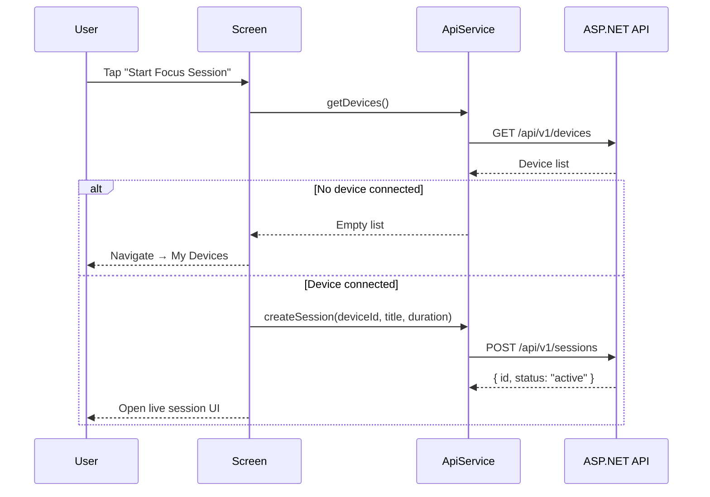

# Flutter Mobile Application

> **Repository:** [`HazeClue/HazeClue`](https://github.com/HazeClue/HazeClue)

The HazeClue Flutter app is the primary user-facing interface for the cognitive enhancement platform. It integrates directly with BLE (Bluetooth Low Energy) hardware, runs AI inference locally using ONNX, and syncs all data to the ASP.NET Core Mobile Backend.

## Tech Stack

| Layer | Technology |
|-------|-----------|
| **Framework** | Flutter 3 (Dart) |
| **Target Platforms** | iOS, Android |
| **State Management** | Provider / Riverpod |
| **HTTP Client** | `api_service.dart` (central Dio/http abstraction) |
| **BLE** | `flutter_blue_plus` |
| **On-Device AI** | `onnxruntime_flutter` |
| **Navigation** | `NavigationShell` pattern (go_router) |
| **Local Storage** | `shared_preferences` (token persistence) |

## App Architecture

The app uses a **NavigationShell** pattern to manage primary tab routing and ensures hardware state (device connectivity) is always validated before sensitive operations:



## Core Screens

### 1. Training & Stimulation

The heart of the application. Before any training session starts, the app validates hardware connectivity via `ApiService.getDevices()`:

```dart
// From api_service.dart
Future<List<Device>> getDevices() async {
  final response = await _dio.get('/api/v1/devices');
  return (response.data as List).map((d) => Device.fromJson(d)).toList();
}
```

**tDCS Session (`tdcs_session_screen.dart`)**
- Fully animated visualization of transcranial electrical stimulation pulses
- Dynamic intensity sliders (current µA, frequency Hz)
- Strict live countdown timer with session logging
- Consent gate via `tdcs_consent_screen.dart` before first use

**Cognitive Training Games**
- `MemoryTrainingScreen` — pattern recall with progressive difficulty
- `ConcentrationPuzzleScreen` — focus-based puzzle mechanics
- On completion, submits cognitive score alongside EEG data:

```dart
// Score submission
await apiService.submitPuzzleScore(sessionId, score, completionTimeSeconds);
// POST /api/v1/sessions/{id}/score
```

### 2. Analytics & Insights (`insights_screen.dart`)

Pulls aggregated behavioral analytics from the Mobile Backend:

| Data Point | API Field |
|-----------|-----------|
| Total focus time | `totalFocusSeconds` |
| Daily average | `averageMinutesPerDay` |
| Improvement % | `improvementPercentage` |
| Weekly chart | `weeklyData[7]` |
| Monthly trend | `monthlyData[6]` |

**Performance ratio calculation:**
```dart
final improvement = (currentWeek - previousWeek) / previousWeek * 100;
```

Combines session analytics with AI-driven health recommendations from `ApiService.getUserInsights()`.

### 3. Hardware Management (`my_devices_screen.dart`)

BLE device scanning and management:

**Supported devices:**
- `Muse S (Gen 2)` — EEG headset
- `NeuroSky MindWave` — EEG headset
- `Halo Sport (tDCS)` — neurostimulation device
- Generic BLE EEG/BCI devices

**Validation gate:**
> Before any tDCS or EEG session starts, the app hard-redirects users to this screen if no compatible device is registered in the backend. This prevents "ghost sessions" with no hardware attached.

## API Integration

All API calls are routed through `api_service.dart` — a centralized HTTP client abstraction:



## On-Device AI (ONNX)

The AI engine exports trained scikit-learn models as ONNX format, which the Flutter app executes locally:

```dart
// From onnx_inference.dart
final session = await OrtSession.fromFile('assets/models/hazeclue_rard.onnx');
final inputTensor = OrtValueTensor.createTensorWithDataList(
  eegFeatures, // Float32List of 105 Riemannian features
  [1, 105],
);
final results = await session.run({'input': inputTensor});
final focusScore = results[0].value[0][0]; // 0.0–1.0
```

**Key advantages:**
- ✅ **Offline inference** — works without internet
- ✅ **< 35ms latency** on modern devices
- ✅ **Privacy-preserving** — raw EEG never leaves the device

## Security & Privacy

**`account_security_screen.dart`**
- In-app password reset flow
- Biometric lock support
- Session token destruction on logout

**`tdcs_consent_screen.dart`**
- Legal consent capture before any neurostimulation session
- User must explicitly agree to safety terms; consent is stored server-side

**Token Management**
```dart
// Store JWT on login
await prefs.setString('auth_token', token);

// Inject token in all requests
final token = prefs.getString('auth_token');
dio.options.headers['Authorization'] = 'Bearer $token';

// Destroy on logout
await prefs.remove('auth_token');
```

## Local Setup

```bash
# Clone the repository
git clone https://github.com/HazeClue/HazeClue.git
cd HazeClue

# Install Flutter dependencies
flutter pub get

# Run on connected device or emulator
flutter run

# Build for release
flutter build apk --release   # Android
flutter build ios --release   # iOS
```
