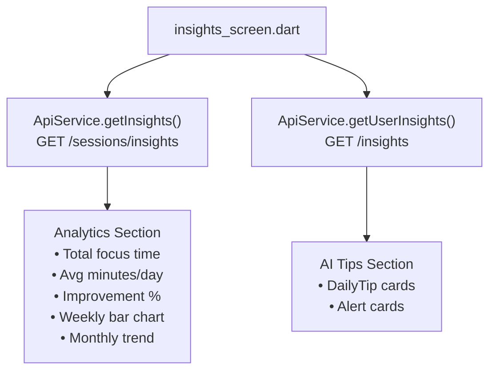

# Insights & Analytics — Flutter

**Files:** `lib/screens/insights_screen.dart` · `lib/screens/sessions_screen.dart`

The Insights screen is the analytics hub of the Flutter app. It pulls performance data from two endpoints and renders charts, trend indicators, and AI-generated health tips.

## Data Sources

| Data | Endpoint | Description |
|------|----------|-------------|
| Performance analytics | `GET /sessions/insights` | Focus time, weekly chart, improvement % |
| AI health tips | `GET /insights` | Rule-based personalized tips |
| Session history | `GET /sessions` | Completed focus sessions list |
| Dashboard stats | `GET /dashboard/stats` | Quick stats for home screen |

## Insights Screen Architecture



## Key Metrics Displayed

### Focus Analytics (from `/sessions/insights`)

```dart
// From insights_screen.dart
final data = await ApiService.getInsights();

final totalFocusSeconds = data['totalFocusSeconds'] as int;
final avgMinutesPerDay  = data['averageMinutesPerDay'] as int;
final improvement       = data['improvementPercentage'] as int;
final weeklyData        = data['weeklyData'] as List;   // 7 ints (minutes)
final monthlyData       = data['monthlyData'] as List;  // 6 ints (minutes)
final avgConcentration  = data['overallAverageConcentration'] as int;
final totalSessions     = data['totalSessionsCount'] as int;
```

**UI elements:**
- Total focus time formatted as `"24h 20m"`
- Improvement badge: `+12% vs last week` (green) / `-8% vs last week` (red)
- **Weekly bar chart:** 7-bar chart, one bar per day (Mon–Sun)
- **Monthly trend chart:** 6-month line chart

### AI Health Tips (from `/insights`)

```dart
final insights = await ApiService.getUserInsights();
// Returns: [{ type, title, message, createdAt }, ...]
```

Tip cards are rendered differently by type:
- `DailyTip` → blue/teal card with 💡 icon
- `Alert` → red/amber card with ⚠️ icon
- `Achievement` → green card with 🏆 icon

## Sessions Screen (`sessions_screen.dart`)

Displays the history of all completed focus sessions with detailed metrics per session:

```dart
final sessions = await ApiService.getSessions();
// [{ id, title, status, averageConcentration, actualDurationSeconds, createdAt }, ...]
```

**Session card shows:**
- Title and date
- Duration formatted as `"19 min 47 sec"`
- Average concentration badge (color-coded by level)
- Status chip (`active` · `completed`)

## Dashboard Stats (Home Screen)

The home/dashboard screen uses `getDashboardStats()`:

```dart
final stats = await ApiService.getDashboardStats();
// { totalSessions, totalFocusMinutes, avgConcentration, streak, ... }
```

## Performance Calculations

These match the server-side logic in `SessionsController`:

```dart
// Improvement percentage display
String get improvementLabel {
  if (improvement > 0) return "+$improvement% vs last week";
  if (improvement < 0) return "$improvement% vs last week";
  return "Same as last week";
}

Color get improvementColor {
  if (improvement > 0) return Colors.green;
  if (improvement < 0) return Colors.red;
  return Colors.grey;
}

// Focus time formatter
String formatFocusTime(int totalSeconds) {
  final hours = totalSeconds ~/ 3600;
  final minutes = (totalSeconds % 3600) ~/ 60;
  if (hours > 0) return "${hours}h ${minutes}m";
  return "${minutes}m";
}
```
