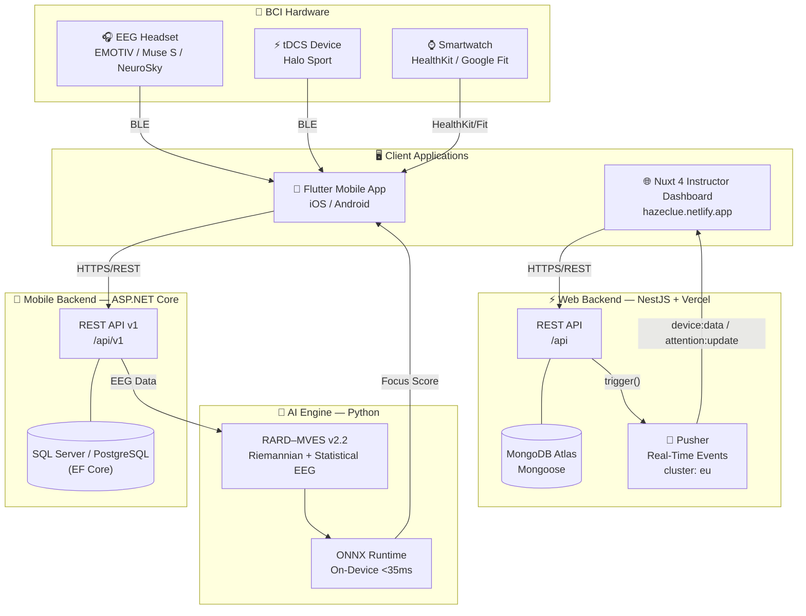

# System Overview

> **HazeClue** is a Brain-Computer Interface (BCI) platform that enhances cognitive performance through integrated EEG monitoring, tDCS neurostimulation, AI-driven insights, and real-time instructor dashboards.

## Platform at a Glance

| Component | Technology | Status | Link |
|-----------|-----------|--------|------|
| **Web Backend API** | NestJS 11 + MongoDB + Pusher | ✅ Production | [haze-clue-backend.vercel.app/api](https://haze-clue-backend.vercel.app/api) |
| **Instructor Web Platform** | Nuxt 4 + Pinia | ✅ Production | [hazeclue.netlify.app](https://hazeclue.netlify.app) |
| **Mobile App** | Flutter 3 | ✅ Production | [github.com/HazeClue/HazeClue](https://github.com/HazeClue/HazeClue) |
| **Mobile Backend API** | ASP.NET Core + EF Core | ✅ Production | [github.com/HazeClue/Haze_clue_backend_mobile](https://github.com/HazeClue/Haze_clue_backend_mobile) |
| **AI Engine** | Python + scikit-learn + ONNX | ✅ Production | [github.com/ameenmv/HazeClue_AI](https://github.com/ameenmv/HazeClue_AI) |
| **Documentation** | VitePress | ✅ This site | — |

## High-Level Architecture

The following diagram illustrates the full HazeClue ecosystem and how data flows through every layer.

## Component Breakdown

### ⚡ Web Backend (NestJS)
Built on **NestJS 11** with a fully modular architecture. Handles instructor-facing operations: session lifecycle management, device telemetry ingestion, real-time broadcasting via **Pusher**, report generation (PDF/CSV), and a comprehensive REST API deployed on Vercel.

**Key modules:** `auth` · `users` · `sessions` · `devices` · `reports` · `dashboard` · `telemetry` · `pusher` · `notifications` · `support`

→ [Web Backend Full Docs](/docs/backend-web/)

---

### 🔷 Mobile Backend (ASP.NET Core)
A **Clean Architecture** ASP.NET Core API that serves the Flutter mobile application. Handles cognitive session recording, EEG score aggregation, smartwatch health data ingestion, and AI-driven user insights.

**Key domains:** `FocusSession` · `PuzzleResult` · `SmartwatchData` · `Device` · `UserInsight`

→ [Mobile Backend Full Docs](/docs/backend-mobile/)

---

### 📲 Flutter Mobile App
The primary user interface. Connects to BLE hardware (EEG, tDCS), runs ONNX AI models locally for offline inference, provides cognitive training games, and syncs data to the Mobile Backend API.

→ [Flutter App Full Docs](/docs/mobile/)

---

### 🌐 Instructor Web Platform (Nuxt 4)
A **Nuxt 4** SSR instructor dashboard that consumes the NestJS Web Backend. Features multi-step session creation wizards, real-time Chart.js dashboards powered by Pusher, post-session analytical heatmaps, and i18n support.

→ [Web Platform Full Docs](/docs/website/)

---

### 🤖 AI Engine
A Python-based **Hybrid Riemannian-Statistical EEG Inference Engine** (`RARD–MVES v2.2`). Dynamically switches inference modes based on real-time signal quality. Models are exported as ONNX for on-device execution in Flutter with sub-35ms latency.

→ [AI Engine Full Docs](/docs/ai/)

## GitHub Organization

All repositories are under the [HazeClue GitHub Organization](https://github.com/HazeClue):

| Repository | Description |
|-----------|-------------|
| [`Haze_clue_backend`](https://github.com/HazeClue/Haze_clue_backend) | NestJS Web Backend API |
| [`Haze_clue_website`](https://github.com/HazeClue/Haze_clue_website) | Nuxt 4 Instructor Platform |
| [`HazeClue`](https://github.com/HazeClue/HazeClue) | Flutter Mobile App |
| [`Haze_clue_backend_mobile`](https://github.com/HazeClue/Haze_clue_backend_mobile) | ASP.NET Core Mobile API |
| [`HazeClue_AI`](https://github.com/ameenmv/HazeClue_AI) | Python AI/ML Engine |
