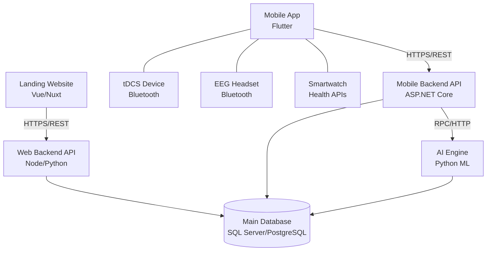

# System Overview

The HazeClue platform is a comprehensive system designed to enhance cognitive performance through the integration of mobile applications, artificial intelligence, and neurostimulation hardware (tDCS and EEG). 

This document outlines the high-level architecture of the system.

## High-Level Architecture

The following diagram illustrates the primary components of the HazeClue ecosystem and their interactions.

## Component Breakdown

1. **Mobile Application (Flutter):** Serves as the primary user interface. It connects to Bluetooth hardware and communicates with the Mobile Backend.
2. **Mobile Backend (.NET Core):** Handles user authentication, device synchronization, cognitive sessions recording, and data storage.
3. **Web Backend & Landing Page:** Handles marketing, web user management, and potentially organizational dashboard functions.
4. **AI Engine:** Analyzes data collected from user sessions, cognitive assessments, and EEG readings to provide personalized insights.
5. **Hardware Interfaces:** Employs Bluetooth Low Energy (BLE) or health APIs (HealthKit/Google Fit) to aggregate physiological data.
