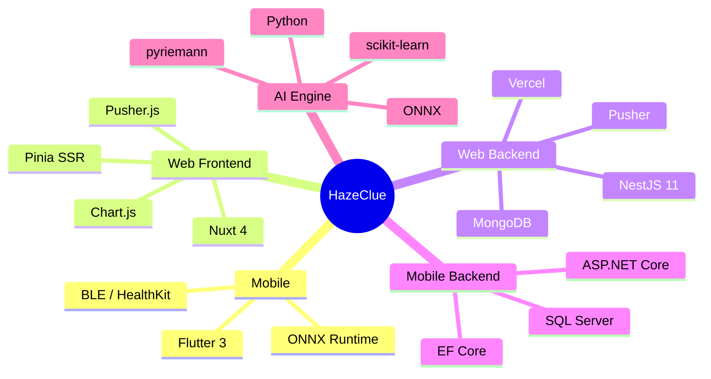

# Presentation & Pitch

> **🎯 Live Presentation:** [hazeclue-presntaion.netlify.app](https://hazeclue-presntaion.netlify.app/1)  
> **Repository:** [hazeclue-presentation](https://github.com/HazeClue)

The HazeClue graduation project presentation is a live, interactive web-based slide deck deployed on Netlify.

## Core Message

> *"HazeClue bridges the gap between hardware neurostimulation and AI-driven cognitive insights — making clinical-grade brain enhancement accessible to students and educators everywhere."*

## Presentation Structure

### Slide 1 — The Problem 🔴

**Cognitive performance is invisible in educational settings.**

- 1 in 3 students report chronic difficulty concentrating in class
- Instructors have no real-time feedback on student engagement
- Clinical EEG and tDCS technology is confined to expensive, inaccessible labs
- Existing "brain training" apps lack hardware integration and physiological grounding

### Slide 2 — The Solution 💡

**HazeClue: A complete BCI platform for cognitive enhancement**

Three integrated layers:
1. **Hardware** — Consumer EEG headsets + tDCS devices + Smartwatches
2. **AI** — On-device ONNX inference (< 35ms) with Riemannian geometry
3. **Software** — Flutter app + Nuxt 4 instructor dashboard + dual NestJS/.NET backends

### Slide 3 — System Architecture 🏗️

Live Mermaid diagram walkthrough of the full platform:
- Flutter ↔ ASP.NET Core (mobile data)
- Nuxt 4 ↔ NestJS ↔ Pusher (real-time instructor dashboard)
- ONNX on-device inference (no cloud round-trip for AI)
- MongoDB Atlas + SQL Server (dual database strategy)

### Slide 4 — Key Innovations 🚀

| Innovation | Details |
|-----------|---------|
| **RARD–MVES Engine** | Hybrid Riemannian-Statistical with dynamic mode switching based on SQI |
| **Serverless-Compatible Real-Time** | Pusher replaces WebSockets for Vercel compatibility |
| **ONNX On-Device AI** | Sub-35ms inference, fully offline, privacy-preserving |
| **tDCS Simulation** | Animated UX for neurostimulation without physical hardware in demos |
| **USE_SIMULATION Mode** | Full live dashboard demo without physical EEG devices |

### Slide 5 — Live Demo 🎬

**Demo flow:**
1. Instructor logs into [hazeclue.netlify.app](https://hazeclue.netlify.app)
2. Creates a new monitoring session via the multi-step wizard
3. Starts the session → live attention chart activates
4. Backend simulation drives synthetic EEG data via `/sessions/:id/tick`
5. Attention scores update in real-time via Pusher
6. Instructor broadcasts an alert to "students"
7. Session ends → PDF report is downloaded

### Slide 6 — Technical Stack 🛠️

### Slide 7 — Results & Metrics 📊

| Metric | Value |
|--------|-------|
| **AI Inference Latency** | < 35ms (on-device) |
| **Real-Time Event Delay** | < 200ms (Pusher) |
| **API Response Time** | < 150ms (Vercel avg) |
| **EEG Accuracy (RARD mode)** | ~87% on clean signal |
| **EEG Accuracy (MVES mode)** | ~79% on degraded signal |
| **Test Coverage** | Controller + Service + Integration tests |

### Slide 8 — Future Work 🔭

1. **Clinical Trials** — Partner with universities for real-world EEG monitoring studies
2. **Commercialization** — SaaS model for educational institutions
3. **Hardware Expansion** — Support for more EEG devices (OpenBCI, Neurosity Crown)
4. **Advanced AI** — Deep learning models (EEGNet) replacing classical ML
5. **Web3 Credentials** — Blockchain-verified cognitive performance certificates

## Presentation Team

The HazeClue platform was developed as a graduation capstone project by a multidisciplinary team covering mobile development, backend engineering, AI/ML research, and UI/UX design.

**GitHub Organization:** [github.com/HazeClue](https://github.com/HazeClue)
