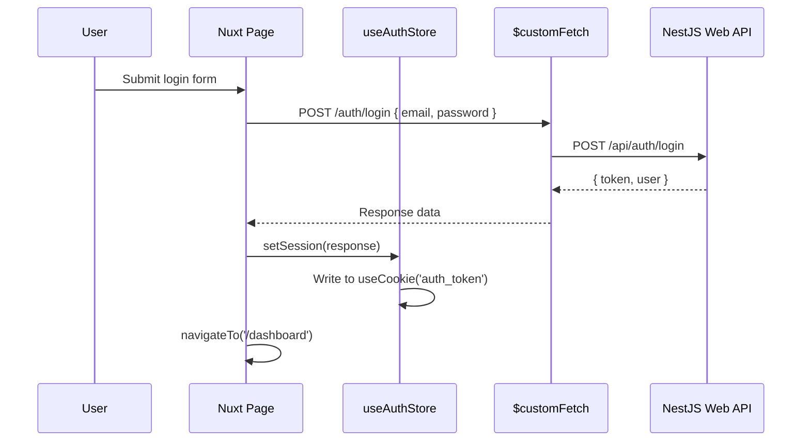

# Auth & Pinia Store — Nuxt 4

Authentication in the Nuxt 4 frontend is built on **Pinia** with SSR-safe `useCookie` for token persistence. The store is the single source of truth for auth state, consumed by middleware, the `$customFetch` plugin, and all page components.

## Auth Store (`app/stores/auth.ts`)

```typescript
export const useAuthStore = defineStore('auth', () => {
  // ─── Cookie-based persistence (SSR + CSR safe) ──────────────
  const tokenCookie = useCookie('auth_token', { path: '/' })
  const userCookie  = useCookie<User | null>('user_data', { path: '/' })

  // ─── Computed State ─────────────────────────────────────────
  const user          = computed<User | null>(() => userCookie.value ?? null)
  const token         = computed<string>(() => tokenCookie.value ?? '')
  const isLoggedIn    = computed(() => !!token.value)
  const isAuthenticated = computed(() => !!user.value && !!token.value)

  // ─── Actions ─────────────────────────────────────────────────
  function setSession(response: LoginResponse, remember = false) {
    userCookie.value = { id: response.id, fullName: response.fullName, email: response.email }
    
    if (remember) {
      // 7-day persistent cookie
      useCookie('auth_token', { maxAge: 60 * 60 * 24 * 7, path: '/' }).value = response.token
    } else {
      tokenCookie.value = response.token
    }
  }

  function clearSession(redirect = true) {
    userCookie.value  = null
    tokenCookie.value = null
    if (redirect) navigateTo('/login')
  }

  return { user, token, isLoggedIn, isAuthenticated, setSession, clearSession }
})
```

### Why `useCookie`?

Nuxt 4 runs on both **server** and **client**. `localStorage` doesn't exist on the server. `useCookie` is the Nuxt-idiomatic solution — it reads from `Set-Cookie` headers on SSR and from `document.cookie` on the client, giving a seamless SSR experience.

## Auth Pages

| Page | File | Description |
|------|------|-------------|
| Login | `app/pages/login.vue` | Email/password sign in |
| Register | `app/pages/register.vue` | Account creation |
| Forgot Password | `app/pages/forgot-password.vue` | Email OTP request |
| Verify OTP | `app/pages/verify.vue` | 6-digit code entry |
| Reset Password | `app/pages/reset-password.vue` | New password with OTP |

## Auth Flow



## Login Page Code

```vue
<!-- app/pages/login.vue -->
<script setup lang="ts">
const { $customFetch } = useNuxtApp()
const authStore = useAuthStore()
const router = useRouter()

const form = reactive({ email: '', password: '', remember: false })

async function handleLogin() {
  const data = await $customFetch('/auth/login', {
    method: 'POST',
    body: { email: form.email, password: form.password }
  })
  
  authStore.setSession(data, form.remember)
  await router.push('/dashboard')
}
</script>
```

## Route Middleware

Protected pages use an `auth` middleware:

```typescript
// app/middleware/auth.ts
export default defineNuxtRouteMiddleware(() => {
  const authStore = useAuthStore()
  if (!authStore.isLoggedIn) {
    return navigateTo('/login')
  }
})
```

Applied to dashboard pages:
```vue
<script setup>
definePageMeta({ middleware: 'auth' })
</script>
```

## Password Reset Flow

```
forgot-password.vue
    → $customFetch('POST /auth/forgot-password', { email })
    → Backend generates OTP, sends email

verify.vue
    → $customFetch('POST /auth/verify-otp', { email, otp })
    ← { resetToken }
    → Store resetToken in query param / session

reset-password.vue
    → $customFetch('POST /auth/reset-password', { email, otp, newPassword })
    → navigateTo('/login')
```

## `LoginResponse` Type

```typescript
// app/types/api/auth.ts
interface LoginResponse {
  token: string
  id: string
  fullName: string
  email: string
}

interface User {
  id: string
  fullName: string
  email: string
}
```

## Auth UI & Layout

The authentication pages use a dedicated `auth` layout (or `welcome` layout) that provides a consistent, distraction-free environment for sign-in and registration. 

- **Theming:** Auth buttons and inputs are styled using the primary application theme colors to ensure a cohesive, modern look.
- **i18n Content:** The welcome layout content (such as taglines and feature highlights displayed alongside the login forms) is fully localized in the `i18n` dictionaries, adapting automatically to Arabic (RTL) and English (LTR).
