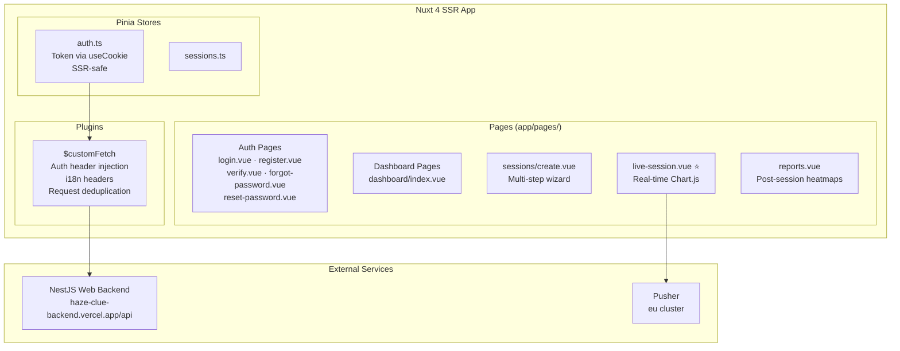

# Instructor Web Platform — Nuxt 4

> **Repository:** [`HazeClue/Haze_clue_website`](https://github.com/HazeClue/Haze_clue_website)  
> **Production URL:** [hazeclue.netlify.app](https://hazeclue.netlify.app)  
> **Deployed on:** Netlify

The instructor web platform is a **Nuxt 4 SSR application** that provides educational institutions with a powerful interface for managing EEG monitoring sessions, viewing live attention dashboards, and analyzing post-session reports.

## Tech Stack

| Layer | Technology |
|-------|-----------|
| **Framework** | Nuxt 4 (Vue 3, Options/Composition API) |
| **Rendering** | SSR (Server-Side Rendering) |
| **State** | Pinia with SSR-safe `useCookie` persistence |
| **HTTP Client** | `$customFetch` plugin (Nuxt `$fetch` wrapper) |
| **Real-Time** | `pusher-js` client |
| **Charts** | Chart.js via `vue-chartjs` |
| **UI Components** | Reka UI |
| **i18n** | `@nuxtjs/i18n` |
| **Deployment** | Netlify |

## Application Architecture



## Authentication Flow (OTP-Based)

The platform implements a full email OTP flow for password recovery:

```
register.vue → POST /auth/register → auto-login
login.vue → POST /auth/login → JWT stored in cookie
forgot-password.vue → POST /auth/forgot-password
verify.vue → POST /auth/verify-otp → resetToken
reset-password.vue → POST /auth/reset-password → redirect to login
```

### Pinia Auth Store

```typescript
// stores/auth.ts
export const useAuthStore = defineStore('auth', () => {
  const token = useCookie('haze_token', { maxAge: 60 * 60 * 24 * 7 }) // 7 days

  async function login(email: string, password: string) {
    const data = await $fetch('/auth/login', { method: 'POST', body: { email, password } })
    token.value = data.token
    return data
  }

  function logout() {
    token.value = null
    navigateTo('/login')
  }

  return { token, login, logout }
})
```

### `$customFetch` Plugin

Every API call goes through this plugin, which automatically:
1. Injects `Authorization: Bearer <token>` header
2. Adds `Accept-Language` header for i18n
3. Deduplicates concurrent identical requests

```typescript
// app/plugins/customFetch.ts
export default defineNuxtPlugin(() => {
  const auth = useAuthStore()

  const customFetch = $fetch.create({
    baseURL: useRuntimeConfig().public.apiBase,
    onRequest({ options }) {
      if (auth.token) {
        options.headers = {
          ...options.headers,
          Authorization: `Bearer ${auth.token}`,
          'Accept-Language': useI18n().locale.value,
        }
      }
    },
  })

  return { provide: { customFetch } }
})
```

## Key Pages

### `sessions/create.vue` — Multi-Step Session Wizard

A guided 3-step wizard for instructors to configure new monitoring sessions:

1. **Step 1: Session Info** — Title, class name, subject, student count
2. **Step 2: Monitoring Settings** — Enable/disable attention tracking, alerts, recording
3. **Step 3: Schedule** — Start immediately or schedule for later

### `live-session.vue` ⭐ — Real-Time Dashboard

The crown jewel of the platform. Connects to **Pusher** and renders live Chart.js visualizations:

```typescript
// Pusher subscription in live-session.vue
const pusher = new Pusher('aa0fca879ef3879464ff', { cluster: 'eu' })
const channel = pusher.subscribe(`session_${sessionId}`)

channel.bind('device:data', (payload) => {
  // Push new attention point to Chart.js
  chart.data.labels.push(formatTime(payload.timestamp))
  chart.data.datasets[0].data.push(payload.attention)
  
  if (chart.data.labels.length > 60) {
    // Sliding window: keep last 60 data points
    chart.data.labels.shift()
    chart.data.datasets[0].data.shift()
  }
  
  chart.update('none') // No animation for performance
})

// Drive simulation on serverless backend
setInterval(async () => {
  await $customFetch(`/sessions/${sessionId}/tick`, { method: 'POST' })
}, 2000)
```

**Dashboard features:**
- 📈 Live line chart (class average attention, 60-point sliding window)
- 🎯 Per-student attention tiles (color-coded: green/amber/red)
- ⚡ Instructor alert broadcasting
- ⏸️ Session pause/resume controls
- 📍 Event marker creation

### `reports.vue` — Post-Session Analytics

Displays heatmaps and statistical summaries from completed sessions, powered by data from `GET /api/reports/:id`.

## Build Optimizations

The Nuxt config implements **aggressive code splitting** for production performance:

```typescript
// nuxt.config.ts
vite: {
  build: {
    rollupOptions: {
      output: {
        manualChunks: {
          'vendor-i18n':   ['@nuxtjs/i18n', 'vue-i18n'],
          'vendor-charts': ['chart.js', 'vue-chartjs'],
          'vendor-reka-ui': ['reka-ui'],
          'vendor-pusher': ['pusher-js'],
        }
      }
    }
  }
}
```

This ensures the massive dashboard loads within milliseconds — each vendor bundle is cached independently by the browser.

## Local Development

```bash
# Clone the repository
git clone https://github.com/HazeClue/Haze_clue_website.git
cd Haze_clue_website

# Install dependencies
npm install

# Set up environment
cp .env.example .env
# Set NUXT_PUBLIC_API_BASE=http://localhost:3001/api

# Start development server
npm run dev
# → http://localhost:3000
```

## Environment Variables

| Variable | Description |
|----------|-------------|
| `NUXT_PUBLIC_API_BASE` | NestJS Backend API URL |
| `NUXT_PUBLIC_PUSHER_KEY` | Pusher public key (`aa0fca879ef3879464ff`) |
| `NUXT_PUBLIC_PUSHER_CLUSTER` | Pusher cluster (`eu`) |
