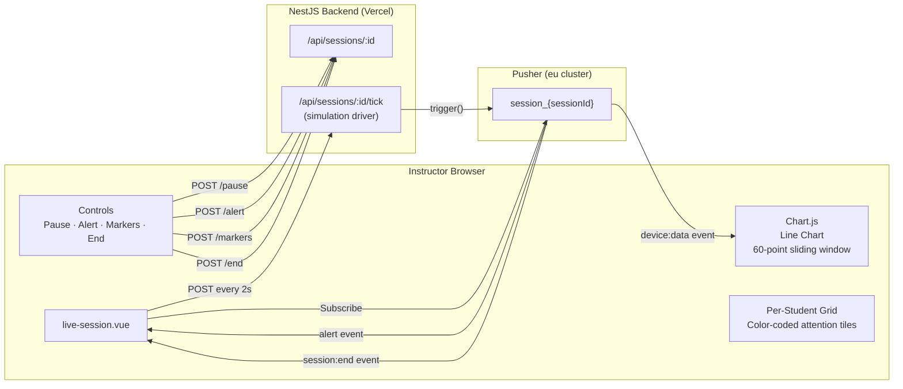

# Live Session Dashboard — Nuxt 4

**File:** `app/pages/dashboard/live-session.vue`

The Live Session page is the crown feature of the HazeClue instructor platform. It connects to Pusher in real-time, renders a sliding-window Chart.js attention graph, and provides instructor controls (alert broadcasting, pause/resume, markers).

## Architecture



## Pusher Subscription

```typescript
// live-session.vue
import Pusher from 'pusher-js'

onMounted(() => {
  const pusher = new Pusher(config.public.pusherKey, {
    cluster: config.public.pusherCluster
  })
  
  const channel = pusher.subscribe(`session_${sessionId}`)
  
  // Real-time attention data
  channel.bind('device:data', (payload: TelemetryPayload) => {
    updateChart(payload.attention, payload.timestamp)
    updateStudentGrid(payload.deviceId, payload.attention)
  })
  
  // Instructor-broadcast alerts
  channel.bind('alert', (payload: { message: string }) => {
    showAlertBanner(payload.message)
  })
  
  // Session ended (from another tab/device)
  channel.bind('session:end', () => {
    router.push(`/dashboard/reports/${sessionId}`)
  })
  
  onUnmounted(() => {
    channel.unbind_all()
    pusher.unsubscribe(`session_${sessionId}`)
    pusher.disconnect()
  })
})
```

## Chart.js Sliding Window

The attention graph maintains a **60-point sliding window** (2 minutes at 2-second intervals):

```typescript
function updateChart(attention: number, timestamp: string) {
  const chart = chartRef.value?.chart

  // Add new data point
  chart.data.labels.push(formatTime(timestamp))
  chart.data.datasets[0].data.push(attention)
  
  // Enforce 60-point window
  if (chart.data.labels.length > 60) {
    chart.data.labels.shift()
    chart.data.datasets[0].data.shift()
  }
  
  // 'none' mode = no animation (critical for performance at 2s intervals)
  chart.update('none')
}
```

**Chart configuration:**
- Type: `line`
- Color: purple gradient fill (`rgba(139, 92, 246, 0.3)`)
- Y-axis: 0–100 (attention score)
- Smooth curves: `tension: 0.4`

## Simulation Tick Driver

On Vercel (serverless), the backend can't run background timers. The frontend drives the simulation:

```typescript
// Drive simulation every 2 seconds
const tickInterval = setInterval(async () => {
  await $customFetch(`/sessions/${sessionId}/tick`, { method: 'POST' })
}, 2000)

onUnmounted(() => clearInterval(tickInterval))
```

Each tick triggers the NestJS backend to generate a simulated EEG data point and broadcast it via Pusher.

## Instructor Controls

### Broadcasting an Alert

```typescript
async function broadcastAlert() {
  await $customFetch(`/sessions/${sessionId}/alert`, {
    method: 'POST',
    body: { message: alertMessage.value }
  })
}
// Pusher broadcasts to all subscribed student devices
```

### Adding Event Markers

```typescript
async function addMarker(label: string) {
  await $customFetch(`/sessions/${sessionId}/markers`, {
    method: 'POST',
    body: { label }
  })
  // Marker appears on session report timeline
}
```

### Pause / Resume

```typescript
async function togglePause() {
  const endpoint = isPaused.value ? 'tick' : 'pause'
  await $customFetch(`/sessions/${sessionId}/${endpoint}`, { method: 'POST' })
  isPaused.value = !isPaused.value
}
```

### End Session

```typescript
async function endSession() {
  await $customFetch(`/sessions/${sessionId}/end`, { method: 'POST' })
  // Pusher broadcasts session:end to all clients
  router.push(`/dashboard/reports/${sessionId}`)
}
```

## Live Monitoring Page (`live-monitoring.vue`)

A simpler read-only monitoring page for observing sessions in progress without instructor controls. Used for display dashboards or co-instructor views.

## Student Attention Grid

```vue
<!-- Per-student attention tiles -->
<div v-for="student in studentData" :key="student.deviceId"
  :class="['student-tile', attentionClass(student.attention)]">
  <span class="student-name">{{ student.studentName }}</span>
  <span class="attention-score">{{ student.attention }}%</span>
</div>
```

```typescript
function attentionClass(score: number): string {
  if (score >= 70) return 'high'    // Green
  if (score >= 40) return 'medium'  // Amber
  return 'low'                       // Red
}
```
